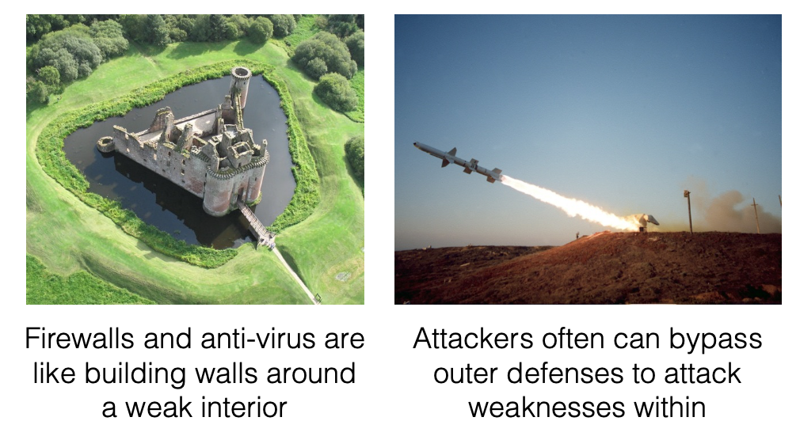

# 零、软件的介绍

## 1、什么是计算机安全？

大多数开发人员关心的是正确性（Correctness），也就是得到期望的结果

安全性（Security）关注的是**阻止不期望的行为（undesired behavior）发生**

典型不期望的行为（undesired behavior）

- 数据泄露：违反了可信性（Confidentiality）原则
  - 如企业或用户个人信息的信息泄露
- 非法修改信息或功能：违反了一致性（Integrity）原则
  - 未授权安装软件，破坏数据库
- 拒绝访问：违反了可用性（Availability）原则
  - 如不能进行购买，不能访问个人账户信息

**重大的计算机安全事故**

- **RSA**, March 2011
  - stole tokens that permitted subsequent compromise of customers using RSA SecureID devices
- **Adobe**, October 2013
  - stole source code, 130 million customer record (including passwords)
- **Target**, November 2013
  - stole around 40 million credit and debit cards

**缺陷和漏洞（Defects and Vulnerabilities）**

缺陷是指软件的行为不正确，而漏洞是与安全性相关（security-relevant）的软件缺陷。

缺陷会在软件的设计和实现的时候出现：

- A **flaw** is a defect in the design
- A **bug** is a defect in the implementation

例子：**RSA**软件缺陷

- Exploited an Adobe Flash player vulnerability

1、当在有缺陷的Flash播放器运行一个精心设计的Flash程序时，攻击者可以在运行的机器上执行任意代码

2、这个程序可以嵌入到Excel电子表格中，并在打开电子表格时自动运行

3、电子表格可以附加到伪装成来自可信方的电子邮件中(网络钓鱼)

**正确性和安全性的区别**

Considering **Correctness**：

- The Flash vulnerability is an implementation **bug**
  - All software is buggy. 
- A normal user never sees most bugs, or work around them
  - Most (post-deployment) bugs due to rare feature interactions or failure to handle edge cases
  - 大多数(部署后)bug是由于很少的特性交互或处理边缘情况失败造成的

Considering **Security**：

Key difference: An adversary is not a normal user!

The **adversary will actively attempt to find defects** in rare feature interactions and edge cases.

To ensure security, we must **eliminate bugs** and **design flaws**, and/or make them **harder to exploit**

## 2、什么是软件安全？

软件安全是计算机安全的一类，专注于软件在设计和实现方面的安全性。

具体而言，关注的是**代码（Code）**方面，是一种白盒测试的方法。

相对而言，很多方法是黑盒测试的方法，并不关注具体的代码，例如操作系统的安全、反病毒程序和防火墙等，这些是黑盒的方法。

为什么要考虑软件安全呢？

因为软件安全是直接性的解决可能存在的缺陷。

### 操作系统的安全

操作系统是对程序的调用，即通过系统调用工作：

- 如读写文件
- 收发网络包
- 启动新程序等

通过一些策略控制程序：

- 如使用哪个端口进行通讯，可访问哪些文件夹等

系统安全的局限性：

1、不能使用具体应用相关的策略

- 如对数据库管理系统（DBMS），里面既含有安全性敏感的信息（如账号等），也有非安全性敏感的信息（如何商品描述等），不能进行精细化的管理。

2、操作系统可以看作是执行监视器（**execution monitor**），是根据过去和现在的动作进行决策，不能执行精确的信息流策略。

**所以需要执行软件级别的安全性控制。**

### 防火墙和入侵检测系统

防火墙和入侵检测系统（Firewalls and IDSs）是通过观察，过滤程序的信息交换来达到安全的目的：

- Firewall could block all traffic from particular hosts, or to particular TCP ports
- An IDS could filter packets it recognizes are part of a known exploit pattern

但是都存在一定的局限性：

**Firewall filtering** is coarse-grained, and **unsound**

- Port 80 is assumed to be HTTP (web) traffic, which is assumed benign, but can layer arbitrary traffic over HTTP, e.g., SOAP
  - 端口80被认为是HTTP (web)流量，它被认为是良性的，但是可以在HTTP上分层任意的流量，例如，SOAP

**IDS patterns** fine-grained, but **still unsound**

- Attack traffic can be slightly modified to work around IDS filters (which are often syntactic, not semantic)
- Making filters too fine-grained can hurt performance

**Anti-virus Scanners**

- Anti-virus scanners look for **signs of malicious behavior** in local **files**

- In many ways, anti-virus is related to IDS in looking  for patterns

- Newer forms of anti-virus scanners are sophisticated, but i**n practice are frequently bypassed**

###  例子：Heartbleed

Heartbleed is a **bug** in the commonly used  **OpenSSL** implementation of SSL/TLS, v1.0.1 - 1.0.1f

2014年发现该bug，距离2012发布已经过去了2年。该bug可以读取和返回部分服务器内存漏洞，之后会泄漏密码等个人信息。

**Black box security is incomplete against Heartbleed exploits**

Issue is not at the level of system calls or deposited  files: nothing the OS or antivirus can do

Basic attack packets could be blocked by IDS, but 

- “Packet chunking” may bypass basic filters

- Exfiltrated data on the encrypted channel; invisible to forensics

**Software security** methods attack the **source** of the problem: **the buggy code**

## 3、课程内容

6 unit：

- Memory attacks
- Memory defenses
- Web security
- Secure design/development
- Automated code review
- Penetration testing

例如在前两个单元中包含关于内存攻击和内容防护的内容，具体而言是Low-level Vulnerabilities和Ensuring Memory Safety两个部分，下面是两方面内容的简单概括。

### Low-level Vulnerabilities

Programs written in **C and C++** are susceptible a variety of dangerous **vulnerabilities**

- **Buffer overflows**
  - On the stack
  - On the heap
  - Due to integer overflow Over-writing and over-reading
- **Format string mismatches**
- **Dangling pointer dereferences**

**Attacks**

- Stack smashing 
- Format string attack 
- Stale memory access
- Return-oriented Programming (ROP)

All **violations** of **memory safety** Accesses to memory via pointers that don’t own that memory

### Ensuring Memory Safety

The easiest way to avoid these vulnerabilities is to **use a memory-safe programming language**

- Better still: a **type-safe** language

For C/C++, use **automated defenses**

- Stack canaries
- Non-executable data (aka W+X or DEP) 
- Address space layout randomization (ASLR) 
- Memory-safety enforcement (e.g., SoftBound) 
- Control-flow Integrity (CFI)

**safe programming patterns and libraries**

- Key idea: **validate untrusted input**

