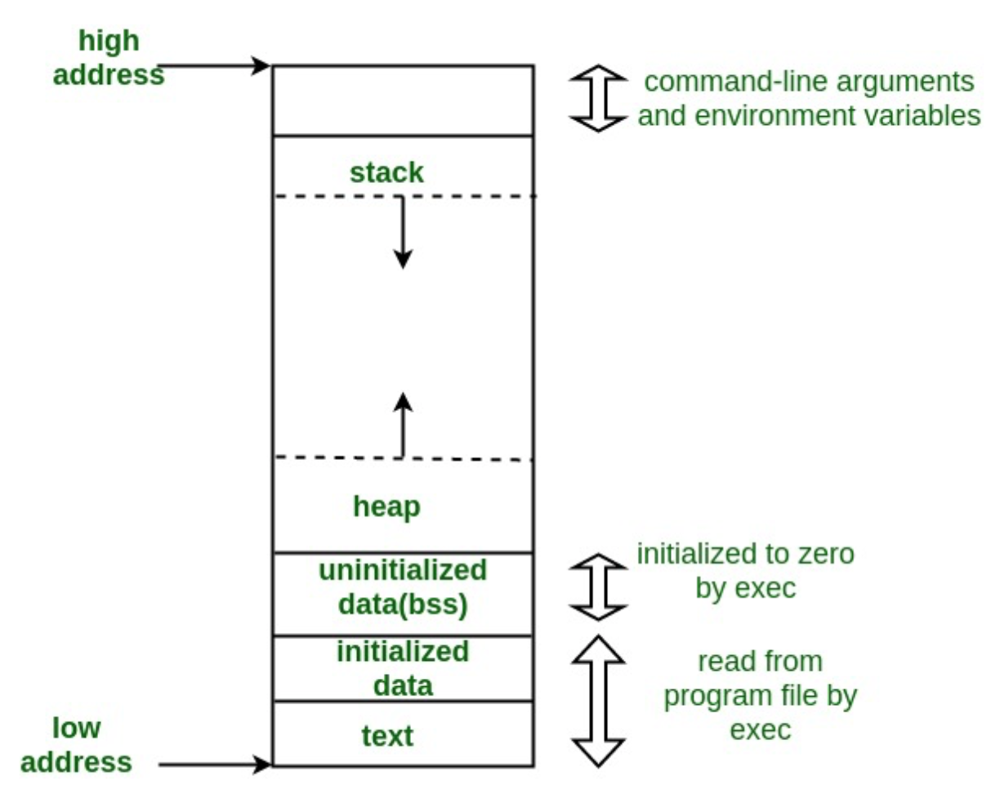
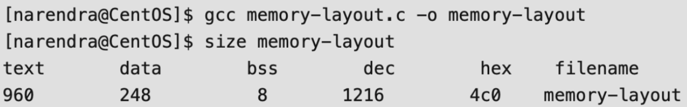
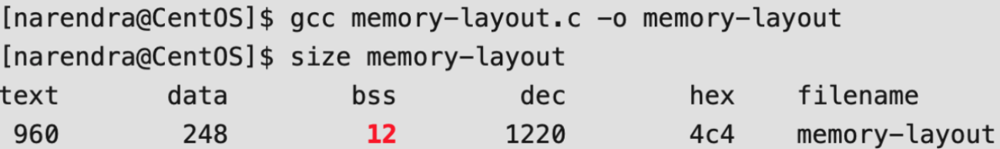
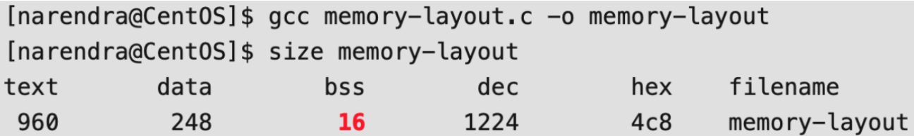
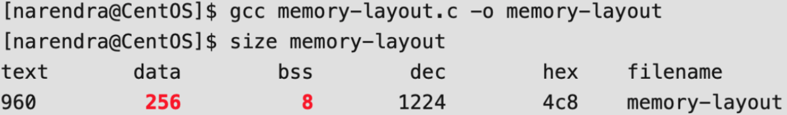

# 1. C程序员通用的漏洞指南

C语言中大多数漏洞都与缓冲区溢出和字符串操作相关，在大多数情况下，都会导致段错误（segmentation fault），但仅过精心设计的输入值，但是，根据体系结构和环境特别设计的恶意输入值可能会导致任意代码的执行。下面列出了最常见的错误和建议的修复/解决方案。

**gets函数**

gets()函数不会检查缓冲区的长度，常常会成为一个漏洞。

有漏洞的代码：

```c
#include <stdio.h>
int main () {
    char username[8];
    int allow = 0;
    printf external link("Enter your username, please: ");
    gets(username); // user inputs "malicious"
    if (grantAccess(username)) {
        allow = 1;
    }
    if (allow != 0) { // has been overwritten by the overflow of the username.
        privilegedAction();
    }
    return 0;
}
```

建议代码：

```c
#include <stdio.h>
#include <stdlib.h>
#define LENGTH 8
int main () {
    char* username, *nlptr;
    int allow = 0;
 
    username = malloc(LENGTH * sizeof(*username));
    if (!username)
        return EXIT_FAILURE;
    printf external link("Enter your username, please: ");
    fgets(username,LENGTH, stdin);
    // fgets stops after LENGTH-1 characters or at a newline character, which ever comes first.
    // but it considers \n a valid character, so you might want to remove it:
    nlptr = strchr(username, '\n');
    if (nlptr) *nlptr = '\0';
 
    if (grantAccess(username)) {
        allow = 1;
    }
    if (allow != 0) {
        priviledgedAction();
    }
 
    free(username);
 
    return 0;
}
```

**strcpy**

内置函数strcpy同样不会检查缓冲区长度，并且可以很好地覆盖与预期目标相邻的内存区域。事实上，整个函数家族也同样脆弱:strcpy、strcat和strcmp。

有漏洞的代码：

```text
char str1[10];
char str2[]="abcdefghijklmn";
strcpy(str1,str2);
```

建议代码：

最好的方式是使用 `strlcpy`函数，它是BSD系统的一个函数，但也很容易定义

```c
#include <stdio.h>
 
#ifndef strlcpy
#define strlcpy(dst,src,sz) snprintf((dst), (sz), "%s", (src))
#endif
 
enum { BUFFER_SIZE = 10 };
 
int main() {
    char dst[BUFFER_SIZE];
    char src[] = "abcdefghijk";
 
    int buffer_length = strlcpy(dst, src, BUFFER_SIZE);
 
    if (buffer_length >= BUFFER_SIZE) {
        printf external link("String too long: %d (%d expected)\n",
                buffer_length, BUFFER_SIZE-1);
    }
 
    printf external link("String copied: %s\n", dst);
 
    return 0;
}
```

另一种稍微不太方便的方法是使用strncpy，它可以防止缓冲区溢出，但不保证'\0'-终止

```c
enum { BUFFER_SIZE = 10 };
char str1[BUFFER_SIZE];
char str2[]="abcdefghijklmn";
 
strncpy(str1,str2, BUFFER_SIZE); /* 限制复制的长度 */
// //我们需要设置BUFFER_SIZE的限制，以便缓冲区中的所有字符都设置为'\0'。如果源缓冲区比BUFFER_SIZE长，那么所有'\0'字符都将被覆盖，副本将被截断。
if (str1[BUFFER_SIZE-1] != '\0') {
    /* 缓冲区被截断，处理错误? */
}
```

#  2. C程序中的内存布局

典型的C程序内存表示由以下部分组成：

1. Text segment

1. Initialized data segment

1. Uninitialized data segment

1. Stack

1. Heap



**1. Text Segment:**

文本段，也称为代码段或简称为文本，是目标文件或内存中程序的一部分，其中包含可执行指令。

作为内存区域，可以将一个文本段放在堆或栈的下面，以防止堆和栈溢出覆盖它。

通常，文本段是可共享的，因此对于经常执行的程序，例如文本编辑器、C编译器、shell等，只需要在内存中保存一个副本。此外，文本段通常是只读的，以防止程序意外地修改其指令。


**2. Initialized Data Segment:**

初始化的数据段，通常简称为数据段。 数据段是程序的虚拟地址空间的一部分，其中包含由程序员初始化的**全局变量和静态变量**。

注意，数据段不是只读的，因为变量的值可以在运行时更改。这个段可以进一步划分为初始化的只读区域和初始化的读写区域。

例如，在C中由char s [] =“ hello world”定义的全局字符串以及在main（即global）外部的int debug = 1之类的C语句将存储在初始化的读写区域中。 像const char * string =“ hello world”这样的全局C语句使字符串文字“ hello world”存储在初始化的只读区域中，而字符指针变量字符串存储在初始化的读写区域中。

例：静态int i = 10将存储在数据段中，全局int i = 10也将存储在数据段中。


**3. Uninitialized Data Segment:**

未初始化的数据段，通常称为“ bss”段，以一个古老的汇编程序运算符命名，代表“以符号开头的块”。 在程序开始执行之前，内核将此段中的数据初始化为算术0。

未初始化的数据从数据段的末尾开始，包含所有初始化为零或在源代码中没有显式初始化的全局变量和静态变量。

例如，一个声明为static int i的变量； 将包含在BSS段中。例如，声明为int j的全局变量； 将包含在BSS段中。


**4. Stack:**

传统上，栈区与堆区相邻，并且方向相反。 当栈指针遇到堆指针时，可用内存就用完了。 （借助现代的大型地址空间和虚拟内存技术，它们可以放置在几乎任何地方，但它们通常仍会朝相反的方向生长。）

栈区域包含程序栈（一种LIFO结构），通常位于内存的较高部分。 在标准PC x86计算机体系结构上，它向地址0增长； 在其他一些架构上，它的发展方向相反。 一个“栈指针”寄存器跟踪栈的顶部。 每次将值“推入”堆栈时都会对其进行调整。 为一个函数调用推入的一组值称为“栈帧”； 堆栈帧至少包含一个返回地址。

栈用于存储临时变量，以及每次调用函数时保存的信息。 每次调用函数时，返回位置的地址以及有关调用者环境的某些信息（例如某些机器寄存器）都保存在栈中。 然后，新调用的函数在栈上为其自动和临时变量分配空间。 这就是C中的递归函数如何工作的方式。 每次递归函数调用自身时，都会使用一个新的栈框架，因此一组变量不会干扰该函数另一个实例的变量。


**5. Heap:**

堆是通常进行动态内存分配的段。

堆区始于BSS段的末尾，并从那里开始增长到更大的地址。堆区由malloc，realloc和free管理，它们可以使用brk和sbrk系统调用来调整其大小（请注意使用 不需要brk / sbrk来实现malloc / realloc / free的契约，也不需要单个“堆区”；也可以使用mmap来实现它们，以将虚拟内存的潜在不连续区域保留到进程的虚拟地址空间中） 。 堆区域由进程中的所有共享库和动态加载的模块共享。


**例子**

1、检查一个简单的程序

```c
#include  <stdio.h>
int main(void) 
{ 
  return 0; 
} 
```



2、在bss中添加未初始化的全局变量

```c
#include  <stdio.h>
int global; /* Uninitialized variable stored in bss*/
int main(void) 
{ 
  return 0; 
} 
```



3、在bss中添加静态变量.

```c
#include  <stdio.h>
int global; /* Uninitialized variable stored in bss*/
int main(void) 
{ 
  static int i;/* Uninitialized static variable stored in bss */
  return 0; 
} 
```



4、初始化后的全局和静态变量存储在 Data Segment (DS)

```c
#include  <stdio.h>
int global = 10; 
int main(void) 
{ 
  static int i = 100;
  return 0; 
} 
```



