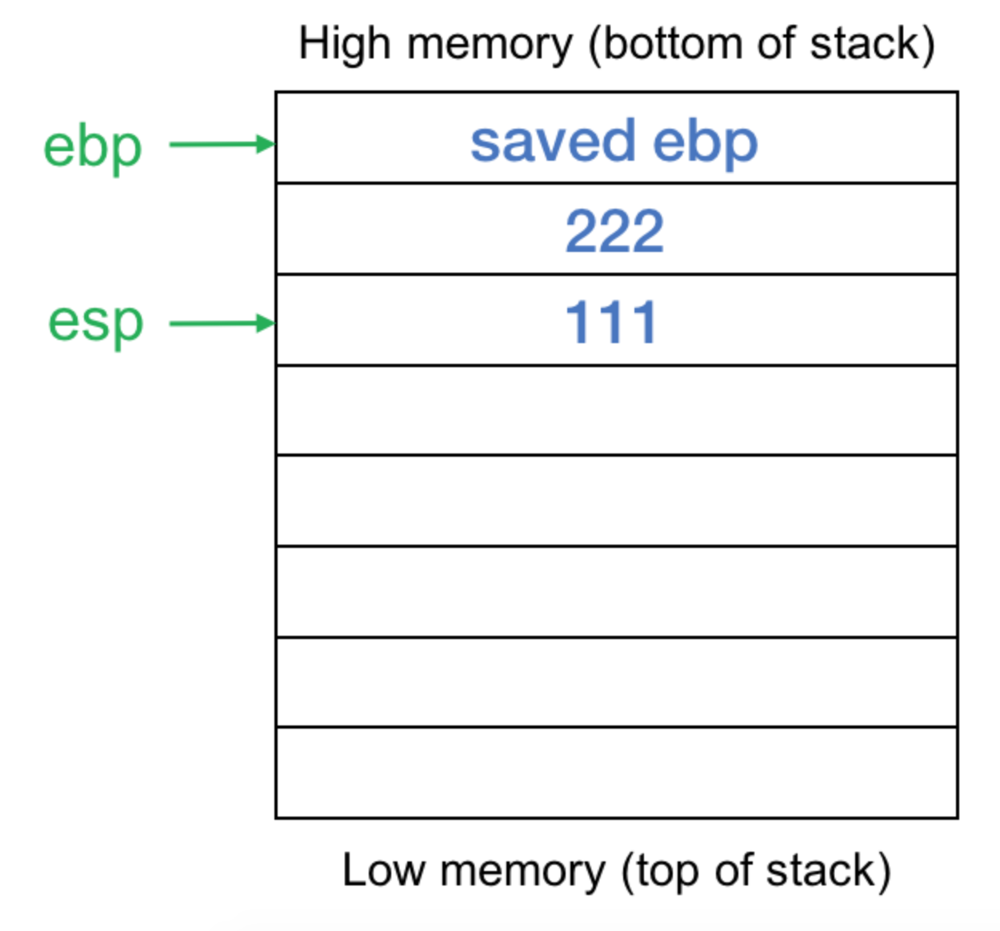
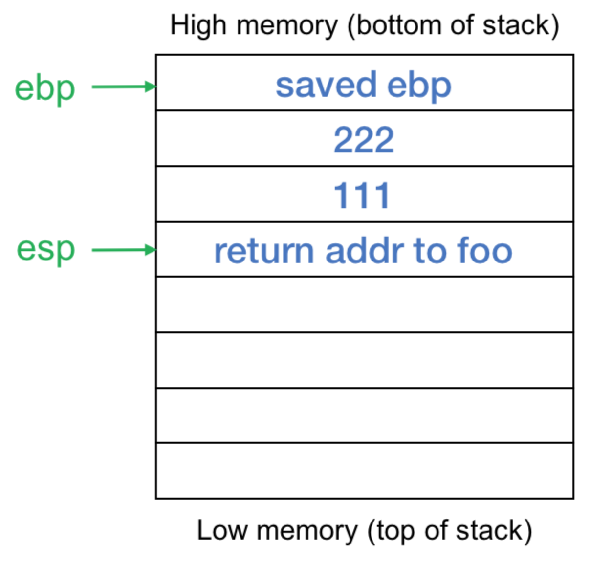
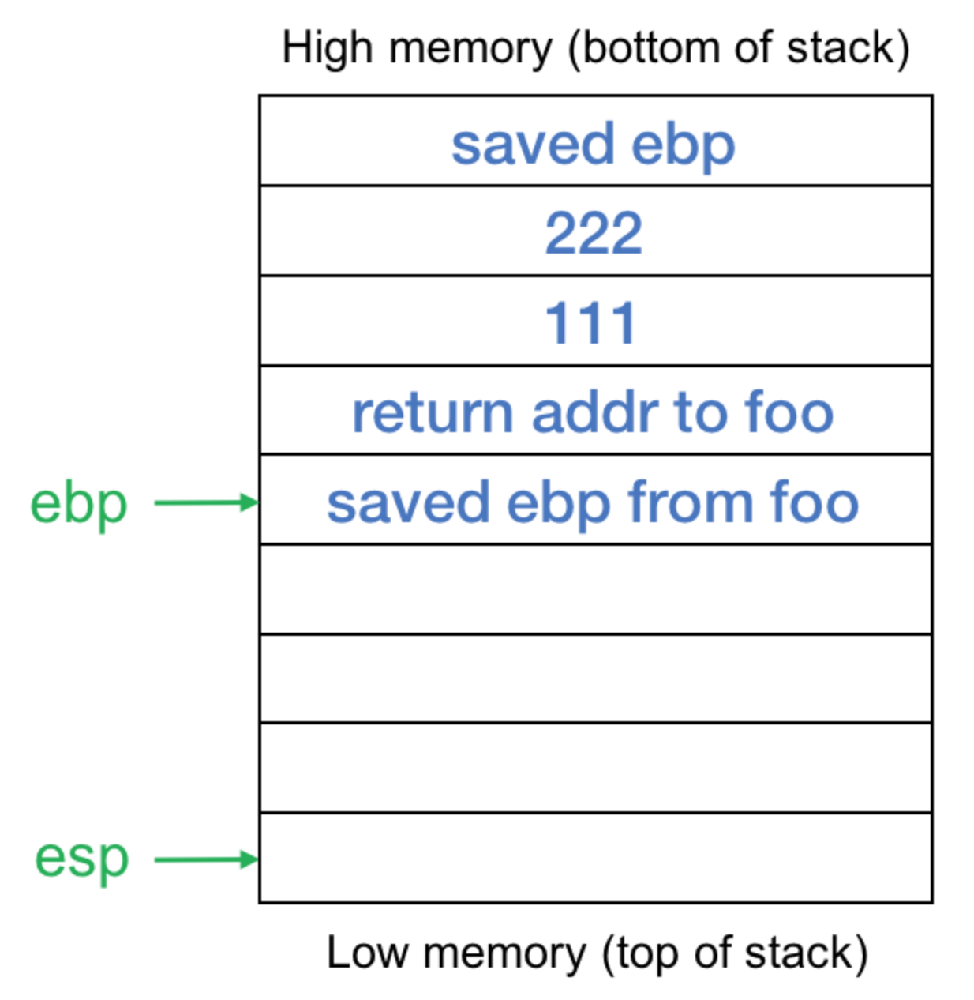
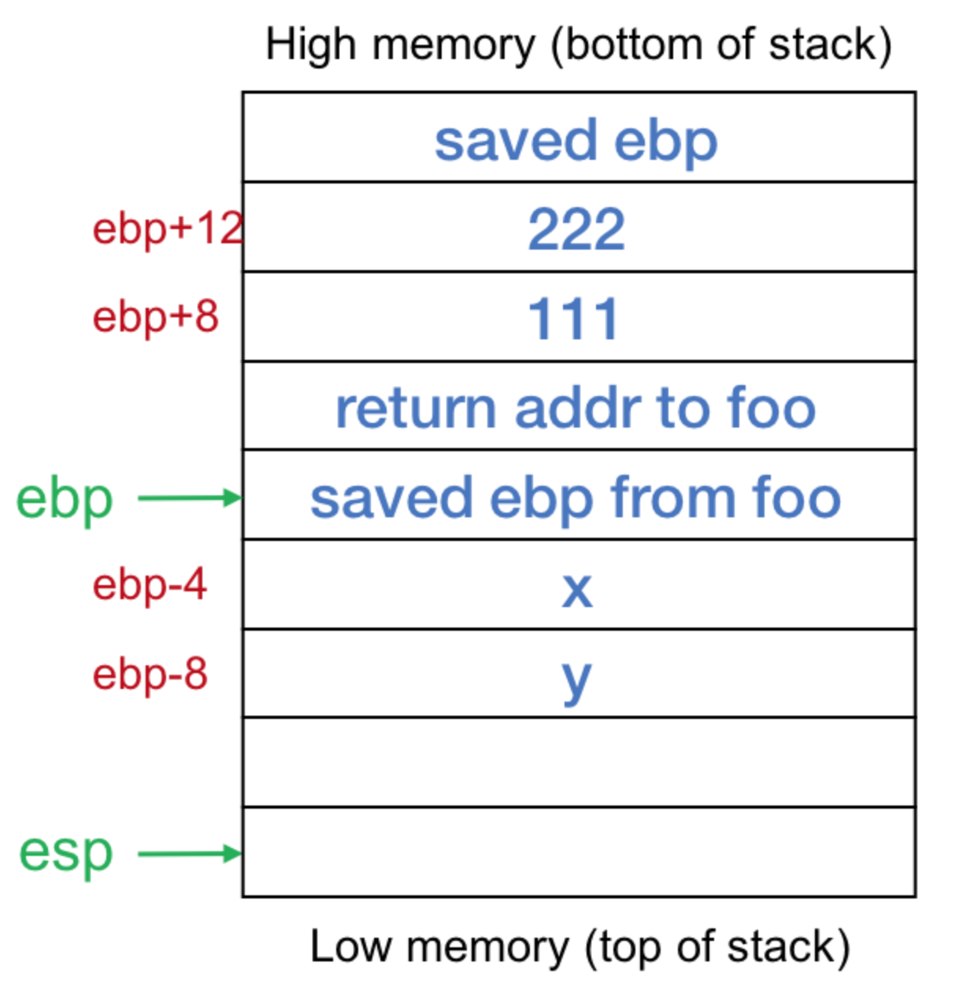

每个函数都有与之相关联的本地内存来保存传入参数、本地变量和(在某些情况下)临时变量。这个内存区域称为栈帧，并在进程的栈上分配。一个帧指针(frame pointer，intel x86架构上的ebp寄存器，64位架构上的rbp)包含函数帧的基本地址。

用于访问函数内局部变量的代码是根据帧指针的偏移量生成的。 栈指针（stack pointer，intel x86架构上的esp寄存器或64位架构上的rsp）在函数执行期间可能会随着将值压入或弹出栈（例如在准备调用另一个函数的过程中压入参数）而改变。 帧指针在整个功能中不会改变。

下面是在函数期间发生的事情(语言/体系结构之间可能有细微的差别)

1、帧指针的当前值(ebp/rbp)压入栈，现保存当前值，以便再后面恢复的时候使用。

2、将当前帧指针(ebp)复制到栈指针(esp)。这定义了帧的开始。

3、从栈指针(esp)中减去函数数据所需的空间。栈是从高内存增长到低内存的。这将栈指针置于函数将使用的空间之外，因此现在压入栈的任何内容都不会覆盖有用的值。

4、现在执行函数的代码。对局部变量的引用将是对帧指针的负偏移量(例如，“movl $123， -8 (%rbp)”)。

5、从函数退出时，将值从帧指针(ebp)复制到栈指针(esp)(这会清除分配给函数的堆栈帧的空间)，然后弹出旧的帧指针(ebp)。这是通过“leave”指令完成的。

6、通过“ret”指令从过程返回。这将从栈中弹出返回值，并将执行转移到该地址。


示例代码(try.c)：

```c
void bar(int a, int b)
{
    int x, y;
    x = 555;
    y = a+b;
}

void foo(void) {
    bar(111,222);
}
```

编译：

```text
gcc -S  -m32 try.c
```

-S选项告诉编译器创建一个汇编文件。 -m32选项告诉编译器为32位体系结构生成代码。

gcc选择使用mov指令（movl）而不是push，因为Intel x86指令集没有将常数值压入堆栈的指令。 调整堆栈，然后将所需的参数移至适当的位置（负偏移量即可完成相同操作）。

生成的代码是(删除包含指向链接器的指令的行):

```text
bar:
    pushl   %ebp
    movl    %esp, %ebp
    subl    $16, %esp
    movl    $555, -4(%ebp) # x=555 a is located at [ebp-4]
    movl    12(%ebp), %eax # 12(%ebp) is [ebp+12], which is the second parameter
    movl    8(%ebp), %edx # 8(%ebp) is [ebo+8], which is the first parameter
    addl    %edx, %eax # add them
    movl    %eax, -8(%ebp) # store the result in y
    leave
    ret
foo:
    pushl   %ebp
    movl    %esp, %ebp
    subl    $8, %esp
    movl    $222, 4(%esp) # this is effectively pushing 222 on the stack
    movl    $111, (%esp) # this is effectively pushing 111 on the stack
    call    bar
    leave
    ret
```

> EAX accumulator; EDX data

> $表示算数数值

> 4(%esp)表示相对与esp的位置


现在来看看如果foo()调用bar()函数的时候bar中的栈帧是如何变化的：

1、在调用bar()之前将参数压入栈




2、在进入bar()函数之前，保存调用者的返回地址



3、在bar函数中创建帧



4、将bar()函数中的参数压入栈



现在bar()函数中的参数可以根据ebp的相对位置找到，于是可以进行计算。

通过利用缓冲区溢出，可以将任意数据写入栈。这意味着可以更改函数的返回地址，也可以更改该返回地址之后的数据—即以前函数的局部变量。在基本的代码注入攻击中，可以将返回地址更改为你选择的代码所在的缓冲区地址。

参考链接：

[__https://www.cs.rutgers.edu/~pxk/419/notes/frames.html__](https://www.cs.rutgers.edu/~pxk/419/notes/frames.html)


