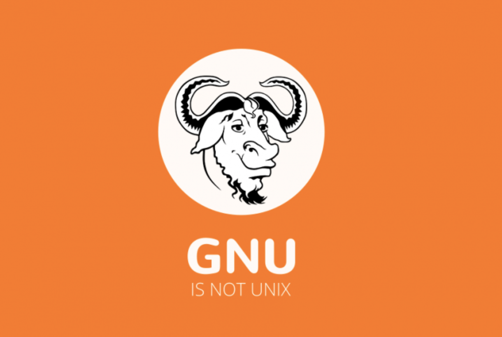

官网地址：

GDB: The GNU Project Debugger：[__http://www.gnu.org/software/gdb/__](http://www.gnu.org/software/gdb/)

顾名思义，GDB是GNU上项目的调试程序，那我们首先来看看GNU是什么，然后再看看如何使用吧。

# GNU是什么？

GNU是一个自由软件操作系统—就是说，它尊重其使用者的自由。

GNU操作系统包括GNU软件包（专门由GNU工程发布的程序）和由第三方发布的自由软件。GNU的开发使你能够使用电脑而无需安装可能会侵害你自由的软件。

从官方解释可以看出，GNU是一个操作系统，它由GNU软件包和第三方自由软件构成。

Unix 系统被发明之后，大家用的很爽。但是后来开始收费和商业闭源了。一个叫 RMS 的大叔觉得很不爽，于是发起 GNU 计划，模仿 Unix 的界面和使用方式，从头做一个开源的版本。然后他自己做了编辑器 Emacs 和编译器 GCC。

GNU 是一个计划或者叫运动。在这个旗帜下成立了 FSF，起草了 GPL 等。

接下来大家纷纷在 GNU 计划下做了很多的工作和项目，基本实现了当初的计划。包括核心的 gcc 和 glibc。但是 GNU 系统缺少操作系统内核。原定的内核叫 HURD，一直完不成。同时 BSD（一种 UNIX 发行版）陷入版权纠纷，x86 平台开发暂停。然后一个叫 Linus 的同学为了在 PC 上运行 Unix，在 Minix 的启发下，开发了 Linux。注意，Linux 只是一个系统内核，系统启动之后使用的仍然是 gcc 和 bash 等软件。Linus 在发布 Linux 的时候选择了** GPL**，因此符合 GNU 的宗旨。

最后，大家突然发现，这玩意不正好是 GNU 计划缺的么。于是合在一起打包发布叫 GNU / Linux。然后大家念着念着省掉了前面部分，变成了 Linux 系统。实际上 Debian，RedHat 等 Linux 发行版中内核只占了很小一部分容量。

GPL是GNU通用公共许可证的意思，是一种开源协议。

常见的开源协议：

- BSD开源协议(original BSD license、FreeBSD license、Original BSD license)

- Apache Licence 2.0(Apache License， Version 2.0、Apache License， Version1.1、Apache License， Version 1.0)

- GPL(GNU General Public License)

- LGPL(GNU Lesser General Public License)

- MIT(MIT)

# GDB安装与使用

安装：sudo apt-get gdb

常用命令：

1.编译：gcc -o xxx xxx.c 

2.生成可调试文件：gcc -o xxx -g xxx.c 

3.调试程序：gdb xxx 

4.执行程序： 

start 从程序第一步开始执行 

run 直接运行程序到结束或者断点处 

5.设置断点：break line(行数）或函数名或者条件表达式 

break 6 在第6行设置断点 

break Swap 在Swap函数入口设置断点 

break 6 if i == 10 在第6行设置断点，要求i == 10 

6.删除断点： 

clear 删除所有断点 

clear 行号 : 删除这行的断点 

clear 函数名 : 删除该函数的断点 

7.info 查看断点 

8.c 继续执行到下一个断点 

9.print +变量 打印变量值 

10.n 下一步 

11.q 退出调试

