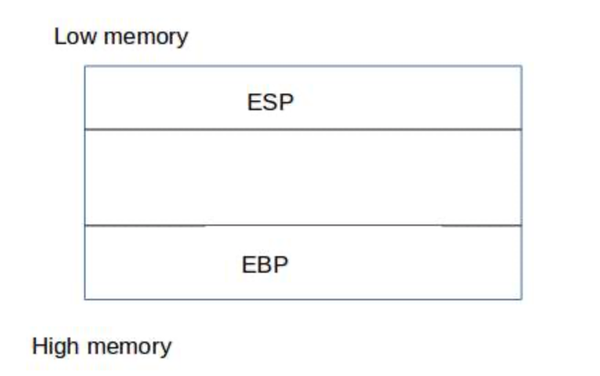
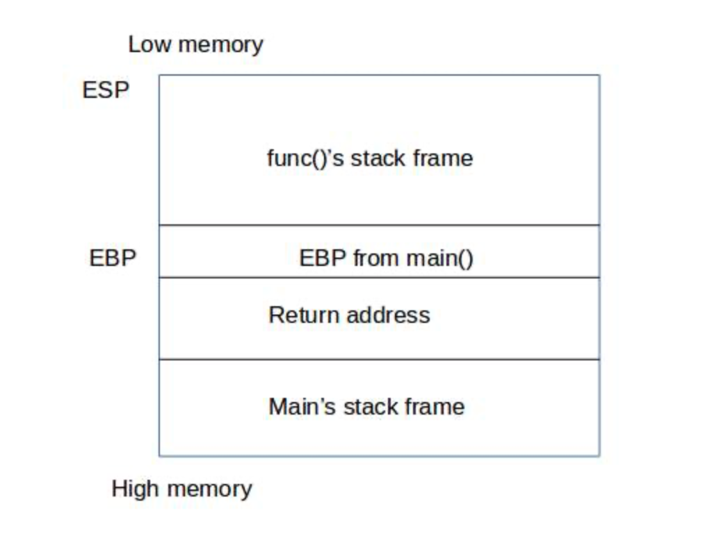
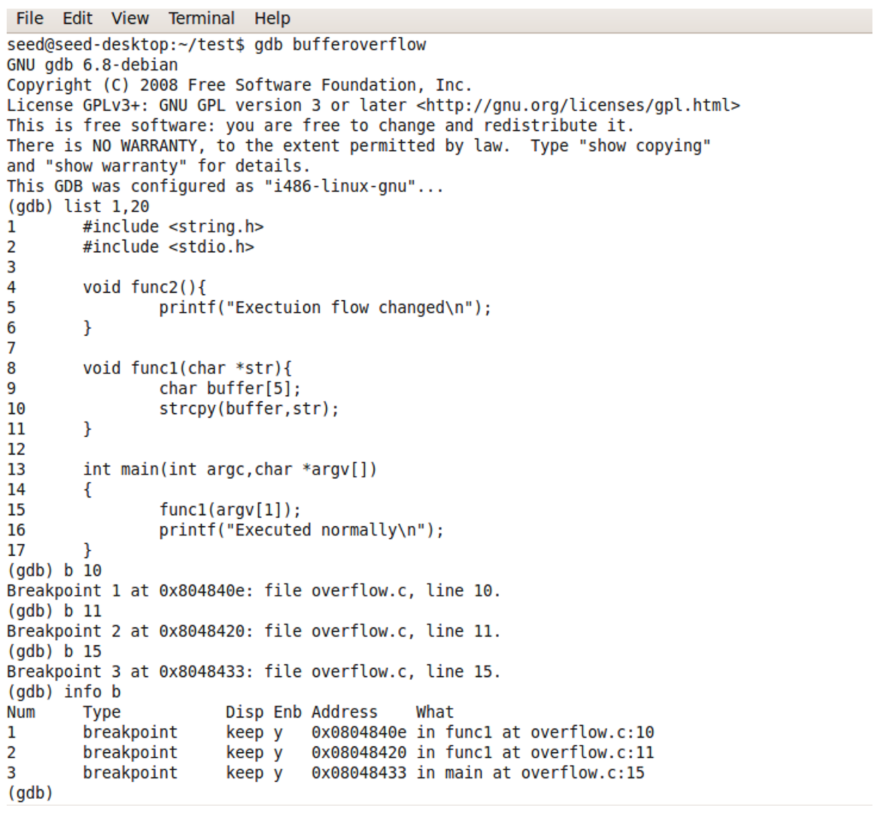
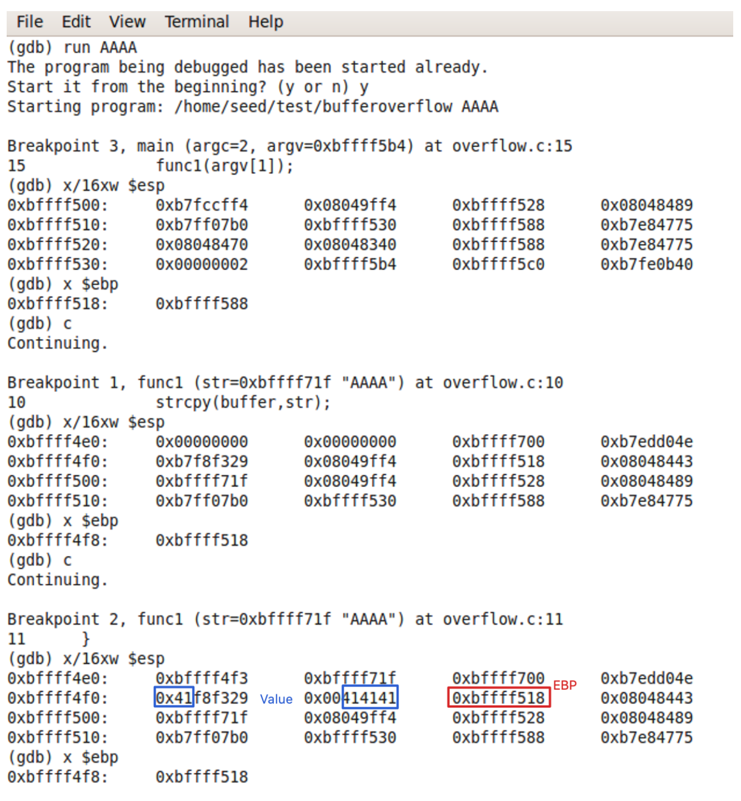
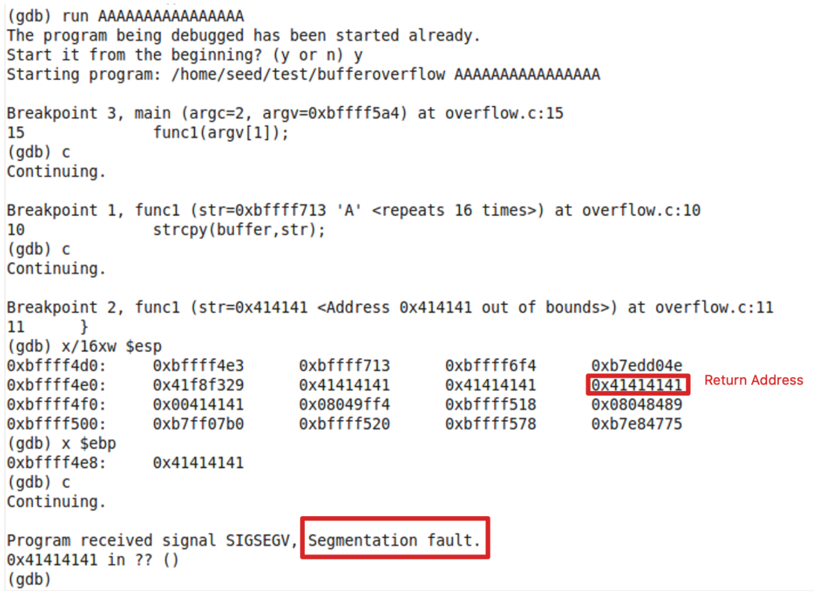
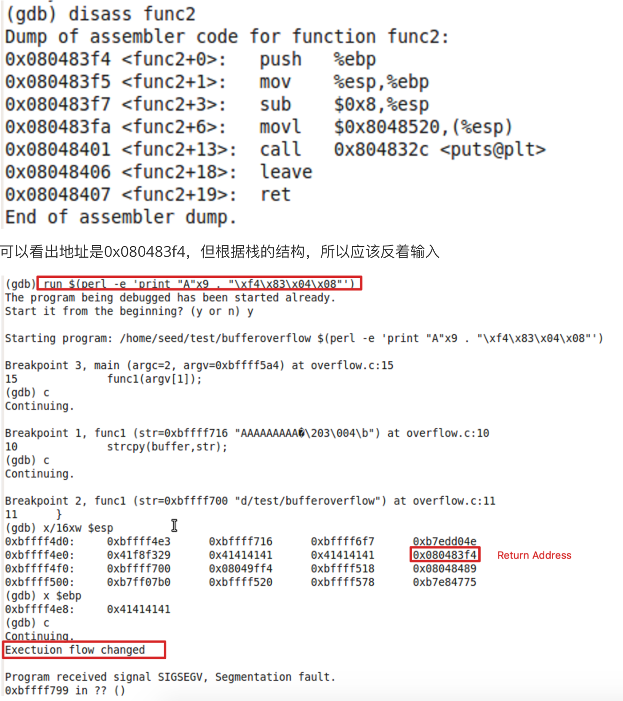
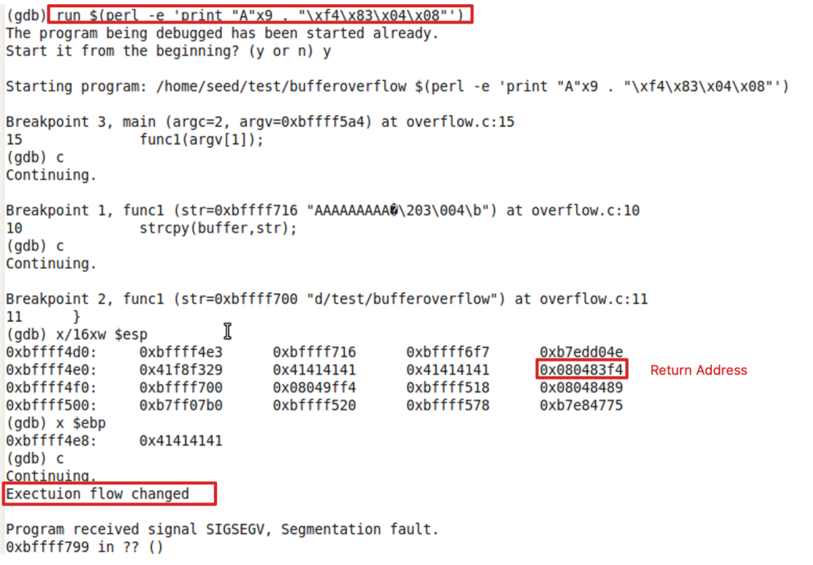
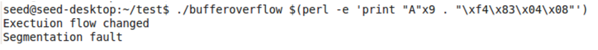

# 一、EBP 、EIP和ESP寄存器

intel系列的CPU中常见的寄存器包括了：

- **EIP** instruction pointer

- **ESP** stack pointer

- **EBP** base pointer

- **ESI** source index

- **EDI** destination index

- **EAX** accumulator

- **EBX** base

- **ECX** counter

- **EDX** data

对于基于栈的缓冲区溢出只需要关注EBP、EIP和ESP寄存器即可。EBP指向栈底部的高地址，ESP指向栈顶部的低地址部分，EIP中保存下一次需要执行的指令。我们主要关注EIP寄存器，因为我们需要劫持其中的执行流。由于EIP是只读寄存器，所以无法给EIP手动设置内存地址并执行它。



当一个函数执行的时候，一个关于此函数相关信息栈帧（stack frame ）将压入栈。一旦函数完成执行，相关的栈帧就会从栈中弹出，并在调用函数停止执行的地方继续执行。CPU必须知道它必须从哪里继续执行，它从调用函数时推送到栈上的返回地址获取此信息。

为了便于理解，我们假设有一个main()函数调用了func()的程序。因此，当程序开始时，main()将被调用，并为它分配堆栈帧并将其推入堆栈。然后main()调用func()，所以在给func()分配栈帧之前，main()函数需要知道func()返回时继续执行的地方（通常是代码行），将这个值（返回地址）压入堆栈。



当func()执行完成并返回后，它的栈帧将被弹出，存储的返回地址将被加载到EIP寄存器中去继续执行main()函数。如果可以控制返回地址，就可以劫持func()返回时执行的指令。


# 二、理解EIP，EBP，ESP的例子

下面是一个C语言程序块：

```c
void fun(void) 
{ 
	printf("hello world")； 
} 
void main(void) 
{ 
	fun() 
	printf("函数调用结束"); 
} 
```

当调用fun函数开始时，EIP，EBP和ESP三者的作用：

1.EIP寄存器里存储的是CPU下次要执行的指令的地址。

 也就是调用完fun函数后，让CPU知道应该执行main函数中的printf（"函数调用结束"）语句了。

2.EBP寄存器里存储的是是栈的栈底指针，通常叫栈基址，这个是一开始进行fun()函数调用之前，由ESP传递给EBP的。（在函数调用前你可以这么理解：ESP存储的是栈顶地址，也是栈底地址。）

3.ESP寄存器里存储的是在调用函数fun()之后，栈的栈顶。并且始终指向栈顶。


当调用fun函数结束后，三者的作用：

1.系统根据EIP寄存器里存储的地址，CPU就能够知道函数调用完，下一步应该做什么，也就是应该执行main函数中的printf（“函数调用结束”）。

2.EBP寄存器存储的是栈底地址，而这个地址是由ESP在函数调用前传递给EBP的。等到调用结束，EBP会把其地址再次传回给ESP。所以ESP又一次指向了函数调用结束后，栈顶的地址。


# 三、基于栈的缓冲区溢出

例如对于下列的代码：

```c
#include <string.h>
#include <stdio.h>
//正常情况下永远不可能被执行的函数！
void function2() {
	printf("Execution flow changed\n");
}
//被main函数调用，存在缓冲区溢出可能
void function1(char *str){
	char buffer[5];
	strcpy(buffer, str);
}
//主函数
void main(int argc, char *argv[])
{
	function1(argv[1]);
	printf("Executed normally\n");
}
```

上述代码中除了主函数外包含2个函数function1()和function2()：

1）main()函数调用function1并且打印出“Executed normally”信息。

2）function1()初始化一个长度为5的缓冲区，并把main函数传递给它的字符串放入缓冲区。

3）function2()打印“Execution flow changed”信息，而且它并没有被任何函数调用。

**目标是通过控制EIP和劫持执行内容来调用function2()函数**


前置知识：GBD调试程序


编译上述代码：

`gcc -g -fno-stack-protector -z execstack -o bufferoverflow overflow.c`

-g：告诉gcc编译器给GBD添加额外的信息

-fno-stack-protector：关闭栈保护机制

-z execstack：使得栈可执行

使用GDB检查程序执行。用GDB打开bufferoverflow二进制文件。使用list命令呈现源代码，然后在函数调用、strcpy()和函数退出时添加断点。



如上图所示，程序的断点在低10、11和15行。

## 2.1 正常情况：输入“AAAA”



## 2.2 错误情况：输入“AAAAAAAA”



## 2.3 劫持EIP

查看func2函数的地址



可以看出地址是0x080483f4，但根据栈的结构，所以应该反着输入



上图输入9个A和func2函数的地址，最后func2的地址会覆盖return address，导致返回func2函数，最终执行了func2函数中的内容。

最终在命令行测试同样的输入，同样会输出func2函数中的内容：




参考链接：

[__https://payatu.com/understanding-stack-based-buffer-overflow__](https://payatu.com/understanding-stack-based-buffer-overflow)


