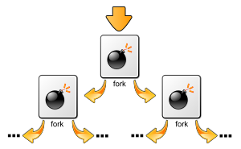
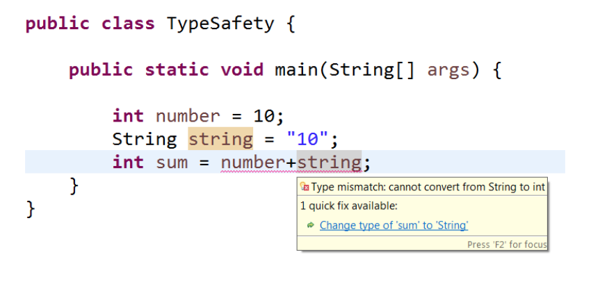

# 一、内存安全

我们通常考虑程序执行是否内存安全。从这个概念，我们认为一个程序是内存安全的，如果它的所有可能的执行都是内存安全的，而一种语言是内存安全的，如果该语言中所有可能的程序都是内存安全的。

内存安全是在处理内存访问时免受各种软件错误和安全漏洞（例如缓冲区溢出和指针悬停）的保护状态。

例如，Java被认为是内存安全的，因为它的运行时错误检测会检查数组范围和指针取消引用。相比之下，C和C ++允许使用任意指针算法，将指针实现为直接内存地址，而无需进行边界检查，因此可能存在内存不安全的情况


## 1.1 历史

内存错误首先是在资源管理和分时系统中会被考虑，用于避免fork bomb的问题。

>fork bomb是一种拒绝服务攻击这种攻击中，进程不断复制自己以耗尽可用的系统资源，由于资源不足而导致系统变慢或崩溃。
>
>


在莫里斯蠕虫病毒利用fingerd的缓冲区溢出之前，研究的进展大多是理论性的。

> 在计算机网络中，Name/Finger协议和Finger用户信息协议是用于交换以人为中心的状态和用户信息的简单网络协议。 通常，协议的服务器端是通过fingerd（用于finger守护程序）程序实现的，而客户端是通过name和finger程序实现的。

此后，计算机安全领域迅速发展，出现了大量新的攻击，如return-to-libc攻击和防御技术，如非可执行堆栈和地址空间布局随机化。

随机化可以防止大多数缓冲区溢出攻击，并要求攻击者使用堆喷洒或其他与应用程序相关的方法来获取地址，尽管采用这种方法的速度比较慢。然而，该技术的部署通常局限于随机库和堆栈的位置。


## 1.2 方法

DieHard，其重新设计的DieHarder和Allinea分布式调试工具是特殊的堆分配器，它们在其自己的随机虚拟内存页中分配对象，从而允许在导致它们的确切指令处停止和调试无效的读写。 保护依赖于硬件内存保护，因此开销通常并不大，尽管如果程序大量使用分配，开销可能会大大增加。随机化仅提供针对内存错误的概率保护，但通常可以通过重新链接二进制文件在现有软件中轻松实现。

Valgrind的memcheck工具使用一个指令集模拟器，并在一个内存检查虚拟机中运行编译后的程序，从而保证能够检测运行时内存错误的子集。但是，它通常会将程序的速度降低40倍，而且必须显式地通知自定义内存分配器。

通过对源代码的访问，可以使用一些库来收集和跟踪指针的合法值(“元数据”)，并根据元数据检查每个指针访问的有效性，例如Boehm垃圾收集器。通常，通过跟踪垃圾收集和在每次内存访问时插入运行时检查，可以安全地确保内存安全;这种方法有开销，但比Valgrind少。所有垃圾收集语言都采用这种方法。对于C和c++，有很多工具可以在编译时对代码进行转换，以在运行时执行内存安全检查，比如CheckPointer和AddressSanitizer工具，它们的平均减速系数为2。

另一种方法是使用静态程序分析和自动定理证明来确保程序没有内存错误。 例如，Rust编程语言实现了借位检查器以确保内存安全。 Coverity之类的工具为C提供了静态内存分析。C++的智能指针是这种方法的局限形式。

## 1.3 内存错误的类型

- **Access errors**: 无效的读/写指针
  - 缓冲区溢出
  - 缓冲区过度读取
  - 竞争条件：读写共享内存时出现
  - 无效页面错误
  - 释放后使用：取消引用悬空指针，该指针存储已删除对象的地址。
- 未初始化变量：使用尚未分配值的变量。 它可能包含不想要的值，或者在某些语言中包含损坏的值。
  - 空指针取消引用：取消引用无效的指针或指向尚未分配的内存的指针
  - 当在初始化到某个已知状态之前使用指针时，会出现野生指针。 它们显示出与悬挂指针相同的不稳定行为，尽管它们不太可能无法被检测到。
- 内存泄漏：当内存使用未跟踪或跟踪错误时
  - 栈耗尽：程序耗尽栈空间时发生，通常是因为递归太深。 保护页通常会暂停程序，以防止内存损坏，但是具有大栈帧的功能可能会绕过该页面。
  - 堆耗尽：程序尝试分配的内存超过可用数量。 在某些语言中，必须在每次分配后手动检查此条件。
  - double free：重复调用free可能会过早释放位于同一地址的新对象。 如果确切的地址尚未重用，则可能会发生其他损坏，尤其是在使用空闲列表的分配器中。
  - 无效的释放-将无效的地址传递给释放会破坏堆。
  - 释放不匹配：使用多个分配器时，尝试使用其他分配器的释放功能释放内存
  - 不必要的别名——当为不相关的目的分配和修改相同的内存位置两次时。


> 参考链接：
https://en.wikipedia.org/wiki/Memory_safety
https://en.wikipedia.org/wiki/Fork_bomb
https://en.wikipedia.org/wiki/Finger_protocol#Finger_user_information_protocol


# 二、类型安全

类型安全时为了防止在编程语言中出现类型错误。

当有人试图对不支持该操作的值执行操作时，会发生类型错误。

简单地说，类型安全确保应该在数据类型x上执行的操作o，而不能在不支持操作o的数据类型y上执行。

也就是说，编程语言要禁止你执行o(y)。


**举例**

JavaScript不是类型安全的编程语言

```javascript
<!DOCTYPE html>
<html>
<body>
<script>
var number = 10; // numeric value
var string = "10"; // string value
var sum = number + string; // numeric + string
document.write(sum);
</script>
</body>
</html>
```

最后输出为1010，输出是数字和字符串的连接。

由于JavaScript不是类型安全的，所以可以不受限制地添加数字和字符串。

但这可能会导致类型安全编程语言中的类型化错误，例如java语言：



可以清楚地观察到，在java中，编译器在编译和抛出编译时异常时验证类型:

> **Type mismatch: cannot convert from String to int**


