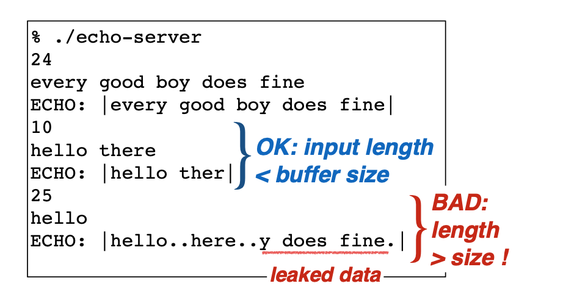

# 一、Memory-based attacks

## 1、课前阅读

本周将通过了解对软件最古老和有害的攻击之一:缓冲区溢出来开始对软件安全性的讨论。缓冲区溢出是一种基于内存的攻击，低级软件(主要是用C和/或c++编写的)很容易受到这种攻击，我们还将考虑其他基于内存的攻击。本周的项目将是构造一个简单的缓冲区溢出漏洞，看看它是如何工作的。

学习目标：

- 理解在x86架构上运行进程的标准内存布局
- 识别C程序中的缓冲区溢出和相关的基于内存的漏洞，比如那些基于格式字符串的漏洞
- 构造一个简单的缓冲区溢出漏洞
- 了解漏洞利用程序如何注入远程代码并执行其他安全漏洞

必读内容：

- [Common vulnerabilities guide for C programmers](https://security.web.cern.ch/security/recommendations/en/codetools/c.shtml).请注意此处列出的不安全的C库函数，以及它们是缓冲区溢出漏洞的根源。 此列表与项目和本周的测验有关。
- [Memory layout](http://www.geeksforgeeks.org/memory-layout-of-c-program/).解释C程序的内存布局，复制第二讲中的讨论。

选读内容：

以下阅读材料是可选的:它们是为了补充你在视频中获得的材料。如果你有兴趣了解更多，或者你想看到它们以不同的方式被解释，请查看它们。

- [How buffer overflows work](http://arstechnica.com/security/2015/08/how-security-flaws-work-the-buffer-overflow/).文章很好地介绍了stack smashing是如何工作的，并讨论了一些针对它的防御措施，这些内容将在下周的资料中更深入地介绍。
-  [PC Assembly Language](http://www.drpaulcarter.com/pcasm/),这本免费的书介绍了x86汇编，并且应该补充在讲座中看到的思想。
- [Smashing the Stack for Fun and Profit](http://insecure.org/stf/smashstack.html) 1996年Aleph One关于这个主题的原创文章
- [Exploiting Format String Vulnerabilities](http://crypto.stanford.edu/cs155/papers/formatstring-1.2.pdf) 报告描述这些格式字符串攻击首次被识别时的情况
- [Basic Integer Overflows](http://phrack.org/issues/60/10.html) 讨论如何溢出的整数可以是一个攻击向量

### 1.1 C程序员通用的漏洞指南

C语言中大多数漏洞都与缓冲区溢出和字符串操作相关，在大多数情况下，都会导致段错误（segmentation fault），但仅过精心设计的输入值，但是，根据体系结构和环境特别设计的恶意输入值可能会导致任意代码的执行。下面列出了最常见的错误和建议的修复/解决方案。

#### gets函数

gets()函数不会检查缓冲区的长度，常常会成为一个漏洞。

#### strcpy

内置函数strcpy同样不会检查缓冲区长度，并且可以很好地覆盖与预期目标相邻的内存区域。事实上，整个函数家族也同样脆弱:strcpy、strcat和strcmp。

### 1.2 C程序中的内存布局

典型的C程序内存表示由以下部分组成：

1. Text segment
2. Initialized data segment
3. Uninitialized data segment
4. Stack
5. Heap

## 2、基于内存的攻击

### 2.1 缓冲区溢出

缓冲区溢出是一种影响底层代码的bug，通常在C和c++中，具有重要的安全影响。通常具有这样bug的程序都比较容易崩溃，但是攻击者可以使这种错误付出更大的代价，比如可以通过缓冲区溢出：

- 盗取个人信息
- 破坏有价值的信息
- 运行攻击者选择的代码

**Q：为什么要学习缓冲区溢出？**

A：

- 缓冲区溢出在今天依旧非常流行
  - C/C++依然是非常流行的编程语言
  - 缓冲区溢出频繁发生
- 缓冲区溢出有很长的历史
  - 存在很多方法来防治缓冲区溢出
- 缓冲区溢出与其他的bug有较多相同的特征
  - 体现在攻击方式和防护的方式上

**Q：C/C++的程序应用在哪些方面？**

A：

- 大多数操作系统的内核
- 高性能的服务器，如SQL server，MySQL等
- 很多嵌入式系统

[常见的导致漏洞的原因（2019年）](http://cwe.mitre.org/top25/archive/2019/2019_cwe_top25.html)

> CWE组织（Common Weakness Enumeration）：a community-developed list of common software and hardware security weaknesses.

按照CWE的标准可以对漏洞进行详细分类。

排名第一的漏洞原因是因为“内存缓冲区范围内的操作限制不当”

[根据NVD组织（National Vulnerability Database）统计](https://nvd.nist.gov/vuln/search/statistics?form_type=Advanced&results_type=statistics&search_type=all&cwe_id=CWE-119)

> 统计Category (CWE): CWE-119 - Improper Restriction of Operations within the Bounds of a Memory Buffer

### 2.2 代码注入

代码注入的基本思想：

1）将自己的代码加载入内存

2）将%eip指向自己的代码

基于代码注入攻击称为堆栈粉碎（ stack smashing），这个术语是Aleph One在1996年创造的。

### 2.3 其它基于内存的攻击

**1）堆溢出（Heap overflow）**

malloc分配的缓冲区也可以发生溢出，该缓冲区驻留在堆上。

- 溢出到C ++对象vtable中
  - C ++对象（包含虚拟函数）使用vtable表示，该表包含指向对象方法的指针
  - 该表类似于我们前面的示例中的s-> cmp，并且类似的攻击方式也将起作用

- 溢出到相邻对象中
  - buff不与函数指针并置，而是在堆上分配相邻的一个

**2）整数溢出（Integer overflow）**

- 若设置nresp为1073741824，而且sizeof(char\*)为4
- nresp\*sizeof(char\*)将为溢出，并将数值变为0
- 随后写入分配的操作会产生溢出

**3）读操作溢出（Read overflow）**

不是写入超过缓冲区的末端，而是读取超过缓冲区的末端，这也有可能泄露机密信息。

举个例子：

上述例子展示了读溢出造成的数据泄漏问题。

相关病毒——Heartbleed

- 这是一种读溢出类型的病毒
- SSL服务器应接受回响的“心跳”消息
- 心跳消息指定了其回应部分的长度，但是有问题的SSL软件未检查长度是否正确。
- 这样，攻击者可能会请求更长的长度，并越过缓冲区的内容
  - 导致密码，加密密钥泄漏。

**5）格式化字符串漏洞**

例如上面2中格式化字符串，第二种的方法存在被攻击的可能。

上述为printf函数的实现过程：

- printf需要传入一些参数
- 类似于调用函数的过程

如果传入的字符串是“%d,%x”，则会向高地址寻找传入的参数，最终会导致调用者的信息泄漏。

# 二、低级攻击的防护

## 1、课前阅读

继续讨论低级软件安全性，了解如何防御基于内存的攻击，如上周介绍的缓冲区溢出和格式字符串攻击。

防御分为两类：自动和手动（基于规范的编程风格）。

我们还将介绍一种称为“返回定向编程”的复杂攻击(return oriented programming)，它的目标是克服一些自动防御，以及针对它的实验性防御。

最后，对于低级攻击，最可靠的防御方法是使用内存安全(或者更好一点，使用类型安全)的编程语言进行编程。

**学习目标：**

- 理解内存安全（ *memory safety*）和类型安全（ *type safety* ）的特点，以及为什么具有这些属性的程序不受基于内存的攻击的影响。
- 了解几种针对基于内存的攻击的常见自动防御措施，包括栈金丝雀（stack canaries），数据执行保护（DEP）和地址空间布局随机化（ASLR）

- 了解基于返回导向的编程（ROP）的攻击如何工作
- 了解控制流完整性（CFI）的概念以及它如何克服基于ROP的攻击
- 了解使用C进行编程的一系列经验法则，以避免基于内存的攻击

**必读内容：**

以下两篇博客文章更深入地介绍了内存安全性和类型安全性主题

- [What is memory safety?](http://www.pl-enthusiast.net/2014/07/21/memory-safety/)
- [What is type safety?](http://www.pl-enthusiast.net/2014/08/05/type-safety/)

选读内容：

攻击和现代防御：

- [On the effectiveness of Address Space Randomization](http://cseweb.ucsd.edu/~hovav/papers/sppgmb04.html), 展示了如何相对轻松地击败32位系统上的ASLR实现
- [Smashing the Stack in 2011](http://paulmakowski.wordpress.com/2011/01/25/smashing-the-stack-in-2011/)，基于栈的攻击
- [Low-level software security by example](http://www.google.com/search?lr=&ie=UTF-8&oe=UTF-8&q=Low-Level+Software+Security+by+Example+Erlingsson+Younan+Piessens), 描述了几种低层攻击和现代防御。

Return-oriented Programming (ROP)：

- [Geometry of Innocent Flesh on the Bone: Return to libc without Function Calls (on the x86)](https://cseweb.ucsd.edu/~hovav/dist/geometry.pdf), 介绍ROP的基本思想
- [Q: Exploit Hardening Made Easy](https://www.usenix.org/legacy/event/sec11/tech/full_papers/Schwartz.pdf),如何自动生成ROP漏洞
- [Blind ROP](http://www.scs.stanford.edu/brop/)，自动的，无需源代码的面向返回的编程

Control-flow integrity (CFI)：

- [Control Flow Integrity](http://research.microsoft.com/pubs/64250/ccs05.pdf), 介绍CFI
- [Enforcing Forward-Edge Control Flow Integrity](https://www.usenix.org/conference/usenixsecurity14/technical-sessions/presentation/tice), 描述了现在在LLVM和gcc中可用的部分CFI实现
- [MoCFI](http://www.cse.lehigh.edu/~gtan/paper/mcfi.pdf), 低开销的模块化CFI
- 另请参见上面的示例“底层软件安全性”

Secure coding

这些是讲座幻灯片中链接的一些参考资料。将在第4周内更深入地介绍安全编码和设计。

- [CERT C coding standard](https://www.securecoding.cert.org/confluence/display/seccode/CERT+C+Coding+Standard)
- [Secure Programming HOWTO](http://www.dwheeler.com/secure-programs/Secure-Programs-HOWTO/internals.html)
- [Robust Programming](http://nob.cs.ucdavis.edu/bishop/secprog/robust.html)
- [DieHard project](http://plasma.cs.umass.edu/emery/diehard.html)，完全替代malloc，它使用随机化来防御基于堆的攻击

