# 一、基于内存的攻击

## 1、课前阅读

本周将通过了解对软件最古老和有害的攻击之一:缓冲区溢出来开始对软件安全性的讨论。缓冲区溢出是一种基于内存的攻击，低级软件(主要是用C和/或c++编写的)很容易受到这种攻击，我们还将考虑其他基于内存的攻击。本周的项目将是构造一个简单的缓冲区溢出漏洞，看看它是如何工作的。

学习目标：

- 理解在x86架构上运行进程的标准内存布局
- 识别C程序中的缓冲区溢出和相关的基于内存的漏洞，比如那些基于格式字符串的漏洞
- 构造一个简单的缓冲区溢出漏洞
- 了解漏洞利用程序如何注入远程代码并执行其他安全漏洞

必读内容：

- [Common vulnerabilities guide for C programmers](https://security.web.cern.ch/security/recommendations/en/codetools/c.shtml).请注意此处列出的不安全的C库函数，以及它们是缓冲区溢出漏洞的根源。 此列表与项目和本周的测验有关。
- [Memory layout](http://www.geeksforgeeks.org/memory-layout-of-c-program/).解释C程序的内存布局，复制第二讲中的讨论。

选读内容：

以下阅读材料是可选的:它们是为了补充你在视频中获得的材料。如果你有兴趣了解更多，或者你想看到它们以不同的方式被解释，请查看它们。

- [How buffer overflows work](http://arstechnica.com/security/2015/08/how-security-flaws-work-the-buffer-overflow/).文章很好地介绍了stack smashing是如何工作的，并讨论了一些针对它的防御措施，这些内容将在下周的资料中更深入地介绍。
-  [PC Assembly Language](http://www.drpaulcarter.com/pcasm/),这本免费的书介绍了x86汇编，并且应该补充在讲座中看到的思想。
- [Smashing the Stack for Fun and Profit](http://insecure.org/stf/smashstack.html) 1996年Aleph One关于这个主题的原创文章
- [Exploiting Format String Vulnerabilities](http://crypto.stanford.edu/cs155/papers/formatstring-1.2.pdf) 报告描述这些格式字符串攻击首次被识别时的情况
- [Basic Integer Overflows](http://phrack.org/issues/60/10.html) 讨论如何溢出的整数可以是一个攻击向量

### 1.1 C程序员通用的漏洞指南

C语言中大多数漏洞都与缓冲区溢出和字符串操作相关，在大多数情况下，都会导致段错误（segmentation fault），但仅过精心设计的输入值，但是，根据体系结构和环境特别设计的恶意输入值可能会导致任意代码的执行。下面列出了最常见的错误和建议的修复/解决方案。

#### gets函数

gets()函数不会检查缓冲区的长度，常常会成为一个漏洞。

#### strcpy

内置函数strcpy同样不会检查缓冲区长度，并且可以很好地覆盖与预期目标相邻的内存区域。事实上，整个函数家族也同样脆弱:strcpy、strcat和strcmp。

### 1.2 C程序中的内存布局

典型的C程序内存表示由以下部分组成：

1. Text segment
2. Initialized data segment
3. Uninitialized data segment
4. Stack
5. Heap

## 2、基于内存的攻击

### 2.1 缓冲区溢出

缓冲区溢出是一种影响底层代码的bug，通常在C和c++中，具有重要的安全影响。通常具有这样bug的程序都比较容易崩溃，但是攻击者可以使这种错误付出更大的代价，比如可以通过缓冲区溢出：

- 盗取个人信息
- 破坏有价值的信息
- 运行攻击者选择的代码

**Q：为什么要学习缓冲区溢出？**

A：

- 缓冲区溢出在今天依旧非常流行
  - C/C++依然是非常流行的编程语言
  - 缓冲区溢出频繁发生
- 缓冲区溢出有很长的历史
  - 存在很多方法来防治缓冲区溢出
- 缓冲区溢出与其他的bug有较多相同的特征
  - 体现在攻击方式和防护的方式上

**Q：C/C++的程序应用在哪些方面？**

A：

- 大多数操作系统的内核
- 高性能的服务器，如SQL server，MySQL等
- 很多嵌入式系统

[常见的导致漏洞的原因（2019年）](http://cwe.mitre.org/top25/archive/2019/2019_cwe_top25.html)

> CWE组织（Common Weakness Enumeration）：a community-developed list of common software and hardware security weaknesses.

按照CWE的标准可以对漏洞进行详细分类。

排名第一的漏洞原因是因为“内存缓冲区范围内的操作限制不当”

[根据NVD组织（National Vulnerability Database）统计](https://nvd.nist.gov/vuln/search/statistics?form_type=Advanced&results_type=statistics&search_type=all&cwe_id=CWE-119)

> 统计Category (CWE): CWE-119 - Improper Restriction of Operations within the Bounds of a Memory Buffer

### 2.2 代码注入

代码注入的基本思想：

1）将自己的代码加载入内存

2）将%eip指向自己的代码

基于代码注入攻击称为堆栈粉碎（ stack smashing），这个术语是Aleph One在1996年创造的。

### 2.3 其它基于内存的攻击

**1）堆溢出（Heap overflow）**

malloc分配的缓冲区也可以发生溢出，该缓冲区驻留在堆上。

- 溢出到C ++对象vtable中
  - C ++对象（包含虚拟函数）使用vtable表示，该表包含指向对象方法的指针
  - 该表类似于我们前面的示例中的s-> cmp，并且类似的攻击方式也将起作用

- 溢出到相邻对象中
  - buff不与函数指针并置，而是在堆上分配相邻的一个

**2）整数溢出（Integer overflow）**

- 若设置nresp为1073741824，而且sizeof(char\*)为4
- nresp\*sizeof(char\*)将为溢出，并将数值变为0
- 随后写入分配的操作会产生溢出

**3）读操作溢出（Read overflow）**

不是写入超过缓冲区的末端，而是读取超过缓冲区的末端，这也有可能泄露机密信息。

举个例子：

上述例子展示了读溢出造成的数据泄漏问题。

相关病毒——Heartbleed

- 这是一种读溢出类型的病毒
- SSL服务器应接受回响的“心跳”消息
- 心跳消息指定了其回应部分的长度，但是有问题的SSL软件未检查长度是否正确。
- 这样，攻击者可能会请求更长的长度，并越过缓冲区的内容
  - 导致密码，加密密钥泄漏。

**5）格式化字符串漏洞**

例如上面2中格式化字符串，第二种的方法存在被攻击的可能。

上述为printf函数的实现过程：

- printf需要传入一些参数
- 类似于调用函数的过程

如果传入的字符串是“%d,%x”，则会向高地址寻找传入的参数，最终会导致调用者的信息泄漏。

# 二、低级攻击的防护

## 1、课前阅读

继续讨论低级软件安全性，了解如何防御基于内存的攻击，如上周介绍的缓冲区溢出和格式字符串攻击。

防御分为两类：自动和手动（基于规范的编程风格）。

我们还将介绍一种称为“返回定向编程”的复杂攻击(return oriented programming)，它的目标是克服一些自动防御，以及针对它的实验性防御。

最后，对于低级攻击，最可靠的防御方法是使用内存安全(或者更好一点，使用类型安全)的编程语言进行编程。

**学习目标：**

- 理解内存安全（ *memory safety*）和类型安全（ *type safety* ）的特点，以及为什么具有这些属性的程序不受基于内存的攻击的影响。
- 了解几种针对基于内存的攻击的常见自动防御措施，包括栈金丝雀（stack canaries），数据执行保护（DEP）和地址空间布局随机化（ASLR）

- 了解基于返回导向的编程（ROP）的攻击如何工作
- 了解控制流完整性（CFI）的概念以及它如何克服基于ROP的攻击
- 了解使用C进行编程的一系列经验法则，以避免基于内存的攻击

**必读内容：**

以下两篇博客文章更深入地介绍了内存安全性和类型安全性主题

- [What is memory safety?](http://www.pl-enthusiast.net/2014/07/21/memory-safety/)
- [What is type safety?](http://www.pl-enthusiast.net/2014/08/05/type-safety/)

选读内容：

攻击和现代防御：

- [On the effectiveness of Address Space Randomization](http://cseweb.ucsd.edu/~hovav/papers/sppgmb04.html), 展示了如何相对轻松地击败32位系统上的ASLR实现
- [Smashing the Stack in 2011](http://paulmakowski.wordpress.com/2011/01/25/smashing-the-stack-in-2011/)，基于栈的攻击
- [Low-level software security by example](http://www.google.com/search?lr=&ie=UTF-8&oe=UTF-8&q=Low-Level+Software+Security+by+Example+Erlingsson+Younan+Piessens), 描述了几种低层攻击和现代防御。

Return-oriented Programming (ROP)：

- [Geometry of Innocent Flesh on the Bone: Return to libc without Function Calls (on the x86)](https://cseweb.ucsd.edu/~hovav/dist/geometry.pdf), 介绍ROP的基本思想
- [Q: Exploit Hardening Made Easy](https://www.usenix.org/legacy/event/sec11/tech/full_papers/Schwartz.pdf),如何自动生成ROP漏洞
- [Blind ROP](http://www.scs.stanford.edu/brop/)，自动的，无需源代码的面向返回的编程

Control-flow integrity (CFI)：

- [Control Flow Integrity](http://research.microsoft.com/pubs/64250/ccs05.pdf), 介绍CFI
- [Enforcing Forward-Edge Control Flow Integrity](https://www.usenix.org/conference/usenixsecurity14/technical-sessions/presentation/tice), 描述了现在在LLVM和gcc中可用的部分CFI实现
- [MoCFI](http://www.cse.lehigh.edu/~gtan/paper/mcfi.pdf), 低开销的模块化CFI
- 另请参见上面的示例“底层软件安全性”

Secure coding

这些是讲座幻灯片中链接的一些参考资料。将在第4周内更深入地介绍安全编码和设计。

- [CERT C coding standard](https://www.securecoding.cert.org/confluence/display/seccode/CERT+C+Coding+Standard)
- [Secure Programming HOWTO](http://www.dwheeler.com/secure-programs/Secure-Programs-HOWTO/internals.html)
- [Robust Programming](http://nob.cs.ucdavis.edu/bishop/secprog/robust.html)
- [DieHard project](http://plasma.cs.umass.edu/emery/diehard.html)，完全替代malloc，它使用随机化来防御基于堆的攻击

## 2、内容摘要

- 内存安全与类型安全
  - 满足这两个属性可以确保程序免疫内存类的攻击
- 自动防御
  - stack canaries
  - 地址空间布局随机化（ASLR）
- Return-oriented Programming (ROP)攻击
  - Control-flow integrity (CFI)怎么防御ROP
- Secure coding

## 3、内存安全

一个内存安全的程序执行的时候：

- 只会使用标准方法创建指针
  - 如malloc方法，以及合法的指针传递
  - 访问的时候内存区域是已经分配或者已经初始化的区域
- 只会访问“属于”该指针可达的内存区域

上述两个想法也可认为是时间安全和空间安全（**temporal safety** and **spatial safety**）。

### 3.1 空间安全

首先将指针看作是一个三元组(p,b.e)

- p表示当前指针的指向
- b表示指针存在的基地址
- e表示指针的指向范围，即上界

则指针p可以允许被访问的空间变为$b\le p \le e-sizeof(typeof(p))$。

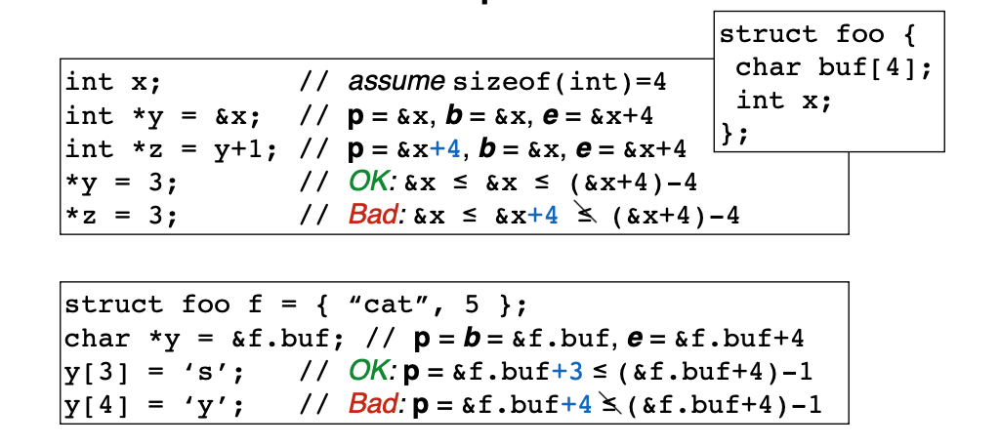

例如在上图第一块代码中：

- x表示具有4个字节的变量
- 取x的地址给y，则y的基地址是x的地址，也是当前p的地址，e是地址上界，即x的地址加4
- z是给y加1，则当前p的指向在原来基础上增加4，b和e不变。
- 给y指向赋值3，是安全的。
- 给z赋值3，这是不可以的，因为z所指向的地址已经是和上界e相同，再复制会导致p的地址不小于e，产生错误。

上图第二块代码是同样的道理。

看看指针指向3元组的可视化例子如下：

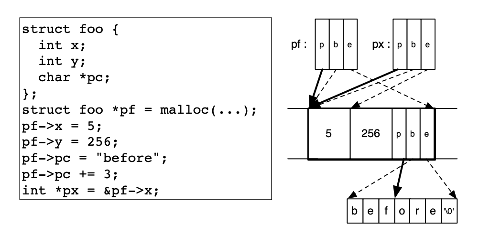

上图中，pf是利用malloc给了一块foo结构的地址，接着：

- pf的x值赋值5，所以p指向往前移动4个字节
- pf的y赋值256，同样移动4个字节
- pf中最后一个char类型的指针赋值一个字符串，并在之后增加3个单元，p指向如上图所示
- 最后pf指向x的地址赋值给x，示例图如上所示。

上述的访问过程都在p指针被允许的范围之内的。

### 3.2 时间安全

当违反时间安全的时候通常会访问还没有定义的内存空间。

- 内存空间被定义意味着被分配了空间
- 内存空间没有定义意味着没有分配内存，没有初始化或内存空间已经被收回。

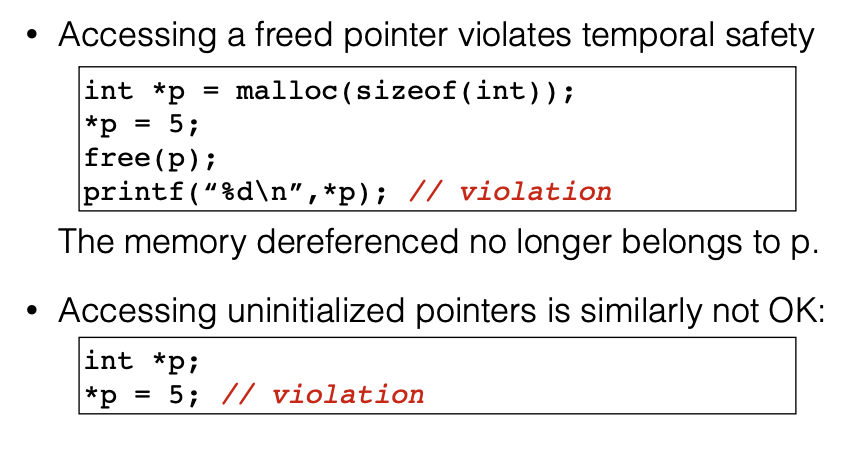

上图展示了访问已释放的内存和未初始化内存出现的错误。

### 3.3 内存安全语言

避免内存漏洞最简单的方式是使用内存安全语言。

很多编程语言都是内存安全的，例如：

- Java，Python，C#，GO···

## 4、类型安全

类型安全是一种比内存安全更强的安全性。

每个对象都有一个类型（int，指向int的指针，指向函数的指针），并且对该对象的操作始终与该对象的类型兼容。

动态类型编程语言：

- 动态类型语言（例如Ruby和Python）不需要声明类型的声明，也可以视为类型安全的语言。
- 每个对象都有一种类型：动态
  - 动态对象上的每个操作都是允许的，但可能没有实现。在这种情况下，它将引发异常。

**类型与安全**

类型强制不变量（Type-enforced invariants ）可以直接与安全属性相关。

例如包含信息流的Java（**Java with Information Flow (JIF)**）：

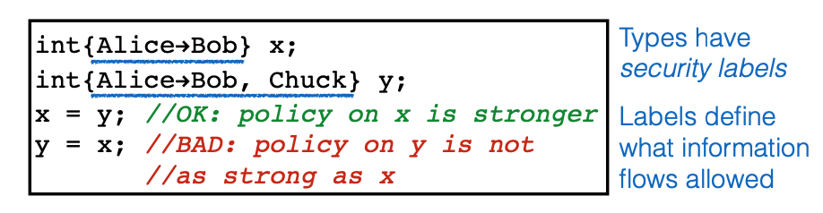

在上述例子中：

- x变量中的信息流为，安全策略表示x中的信息由主体Alice控制，并且Alice允许主体Bob看到此信息。
- y变量中的信息流为，安全策略表示y中的信息由主体Alice控制，并且Alice允许主体Bob和主题Chunk看到此信息。
- 所以y变量可以复制到x
- 但x的变量不能复制给y，因为信息量不足。

**为什么要类型安全？**

C/C++是因为性能原因没有类型安全机制。

典型的类型安全实施成本很高：

- 垃圾回收机制，用于避免内存空间时间冲突
- 边界和空指针检查，避免空间冲突
- 隐藏表示可能会抑制优化
  - 很多指针运算和取地址操作不被允许

但现在也有很多新兴的编程语言既可以有C/C++的性能，也可以保证是类型安全的，例如：

- Google’s **Go** 
- Mozilla’s **Rust** 
- Apple’s **Swift**

这些语言可能是底层编程的未来。

##5、避免漏洞利用

避免漏洞利用（Avoiding Exploitation）：当我们不得不使用C/C++这些并不保证内存安全和类型安全的底层语言的时候，那就需要来防止在程序中利用漏洞的行为。

通常有2种基本的防御方法：

- 让漏洞很难被利用
  - 漏洞仍然存在于程序中，但是对手将很难使用它们来执行远程代码注入。
  - 是利用漏洞过程中涉及的一个或多个步骤更加困难，甚至是不可能的。

- 避免漏洞
  - 采用不太可能引入错误的编码过程。
  - 高级代码审查和测试技术来在部署之前发现错误。

减轻漏洞利用和防止错误的这两种方法是互补的。 实际上，两者都用于现代软件开发过程中。

如何避免漏洞被利用呢？

首先之前提到的栈粉碎攻击有如下的步骤：

- 将攻击者的代码放入内存中（非0字符串）
- 将%eip中地址指向攻击者的代码
- 查找返回地址

那么如何使得每一步变得更加困难呢？

在最好的情况下，我们可以通过更改库，编译器和操作系统来使利用漏洞变得复。 这样，就可以不用修改应用程序代码，毕竟代码是很难保证正确更改。 解决方法是在体系结构设计中，就可以执行一次并将其应用于所有程序。

### 5.1 栈金丝雀

在19世纪的时候，煤炭工人在进入矿洞之前会先放入一只金丝雀进入，如果金丝雀死了，说明矿洞有毒，不能进入。

类比到栈中，也可以用类似的办法来保证栈的完整性。

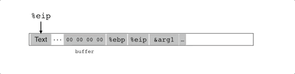

检查栈中“金丝雀”的值，如果和原来的不一样，说明栈已经溢出。

那么栈中“金丝雀”应该保存什么值呢？

- Terminator canary
  - 试图阻止基于库例程（如scanf或strcopy）的攻击。 而且它使用诸如回车，换行，空值之类的东西，这些例程无法处理这些东西，因此将无法在那里存放它们。
- Random canary
  - 当进程启动时，它将选择一个随机值，将其存储在内存中的某个位置并对其进行写保护，以便程序随后不会对其进行更改。 
  - 将使用该值将其写为canary。 
  - 使用存储在内存中某处的值来检查金丝雀是否保持不变。
- Random XOR canary
  - 与随机的方法类似，不过增加了与随机值与一些控制信息的异或。

栈金丝雀的方法可以处理防御低级攻击的第一个挑战：

- 将攻击者的代码放入内存中（非0字符串）
  - 使用栈金丝雀进行检测

第二个挑战是阻止将%eip中地址指向攻击者的代码，实际上可以用直接的方法防御，那就是直接让堆和栈不可执行。如果程序正常运行，则文本段（即代码）是不可变的，并且程序中内存的其他所有部分都是不可执行的。 因此，如果您在其中将代码加载到malloc缓冲区或栈中，该体系结构将阻止您运行它，因为未将其指定为代码区域，因此不允许运行。

- 将%eip中地址指向攻击者的代码
  - 使堆或栈不可执行

不幸的是，这种方法也可以通过称为return-to-libc的攻击来绕过。

### 5.2 return-to-libc

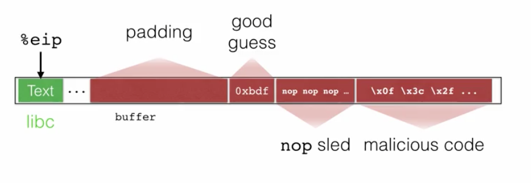

上图展示了一个普通攻击的结果，也就使在填充缓冲区之后有覆盖了EIP寄存器中的内容，接着执行，插入的恶意代码。但在增加了栈金丝雀和堆栈不可执行之后可以避免这种攻击。

return-to-libc与此不同的是，重写返回地址以指向内存中已有的所需代码的某个位置。

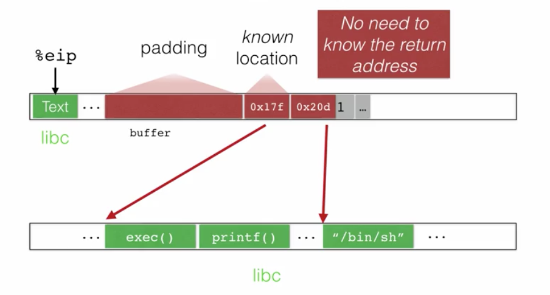

此外，我们覆盖了下一个要成为该内存参数的内容。 例如，在这里，我们将返回指针指向exec来创建一个新进程，然后将堆栈上的下一个指针指向/ bin/sh常量字符串。 这样，当我们从溢出函数返回时，我们会将当前进程转换为shell程序。

这种方法的一个好处是不需要知道绝对返回地址的位置，我们只需要知道我们已经用指向exec和bin/sh的指针来覆盖它了。

因此，我们可以使用一种称为“地址空间布局随机化”的方法来克服这种攻击。

将标准库和系统的其他内存元素（如栈）放置在随机位置，从而使它们难以猜测。 因此，攻击者无法建立一个适合所有利用程序的漏洞，这种攻击程序确切知道exec在每个运行的程序中的位置。 类似也可以使得很难找到返回指针。 堆栈已被随机化，因此每次的位置都不相同。

因此解决了第二和第三个挑战：

- 将%eip中地址指向攻击者的代码
  - 使堆或栈不可执行
  - 地址空间分布随机化（Address-space Layout Randomization）

- 查找返回地址
  - 地址空间分布随机化（Address-space Layout Randomization）

### 5.3 地址空间分布随机化

尽管ASLR使利用漏洞更加困难，但它并不完美。 

- 它只会随机化存储区的偏移量，不会随机化其内容。
- ASLR实现仅适用于标准库，不适用于程序代码。
  - 这是因为如果要将程序代码放在地址空间中，则必须将其编译为与位置无关。
  - 有些程序不是用这种方式编译的，因此它们的应用程序代码不受ASLR重定位的影响。共享库通常以这种方式编译，而应用程序代码并非总是如此。
- ASLR需要足够的随机性来避免暴力攻击。 
  - 研究论文表明，对32位操作系统的Linux ASLR支持容易受到暴力攻击。
  - 成功执行此攻击，平均仅花费216秒。
  - 现代的64位操作系统蛮力攻击变得不可行

## 6、Return-oriented Programming (ROP)攻击

目前为止我们接触的攻击和防御方法：

- 防御：使栈/堆不可执行来阻止代码注入
  - 新的攻击方法：跳转/返回到libc中的代码

- 防御：使用地址空间分布随机化（ASLR）隐藏libc中代码的地址
  - 新的攻击方法：暴力搜索（32位系统中），或者利用格式化字符串漏洞泄漏信息。
- 防御：避免使用整个libic中的代码，不包含应用程序不需要的libc代码。 例如，如果不需要系统库调用，则不要包含它。
  - 新的攻击方法：ROP攻击

ROP不是利用单个的libc函数来运行shellcode，而是将现有的代码片段，称之为小工具（gadgets），将他们组合起来实现攻击。

- 找到需要的小工具（代码片段）
- 将它们组合起来

## 7、控制流完整性

前面所提到的防御的**目标是让攻击变得复杂**。 但是在某些情况下，这些攻击仍然可行。

新的想法：观察一个程序的行为——检查程序是否正在执行我们期望的操作。

- 如果不是，可能受到破坏并偏离了我们的期望。

这样的偏差可能是恶意的，因此当观察到偏差时，程序可能会暂停。

为了使这个想法变得可行，可能会面临如下挑战，并切在每个挑战下面，控制流完整性(control-flow integrity, CFI)是如何应对的：

- 定义程序“期望出现的行为”
  - 控制流图(control flow graph , CFG)

- 有效地检测程序来检查程序的行为
  - 内联引用监视器(in-line reference monitor or IRM)
  - 内联引用监视器是对程序的重写，在其中插入的指令将检查是否保留CFI属性。
- 避免检测程序被破坏
  - 足够的随机性和不可变性

CFI有效吗？ 

经典CFI（2005）的平均开销为16％，在最坏的情况下为45％。 

- 它适用于任意可执行文件，但不是模块化的。 因此它不能很好地处理动态链接的库，这对于经常使用此类库的现代程序来说是个问题。 而且，在最坏的情况下，45％的开销会变得有点高。 也可以解释为什么迄今为止尚未真正部署CFI。

模块化CFI（2014）的方法解决了模块化问题。

- 它支持动态链接的库，并且效率更高。 平均而言，它仅产生5％的开销，而在最坏的情况下，开销仅为12％。 这里的主要缺点是，它仅作为LLVM编译器的一部分在C程序上运行。

CFI是否安全？

对于MCFI，可以防止96％左右的ROP中的工具。

另一项称为平均间接目标减少（AIR）的措施表明，MCFI在排除目标方面确实非常有效。 间接跳转的可能目标，要排除99％或几乎全部排除。 因此，我们在这里查看了相当不错的安全性。

### 7.1 控制流图

对预期行为的定义，即控制流程图或CFG。

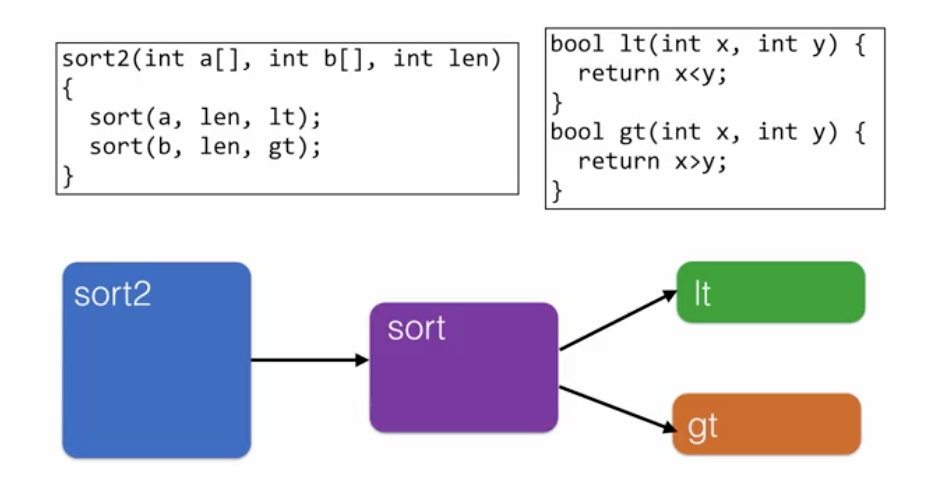

如上图所示可以看出sort2函数调用sort函数，sort函数分别调用了lt和gt函数。

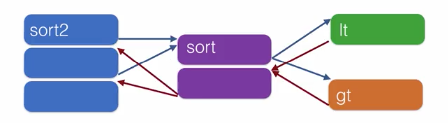

控制流图是通过区分程序中的调用和返回来定义的。把每个函数分解成基本块，其中一个基本块总是以一个跳转、一个返回或一个调用结束。

我们要确保所有的控制流传输都遵循CFG。为此，我们需要提前计算CFG。我们可以在编译过程中这样做，也可以通过分析二进制文件来这样做。MCFI在编译的时候会这样做，而传统的CFI只会分析二进制文件。

### 7.2 内联引用监视器(IRM)

为了监视控制流，我们将使用这个内联引用监视器来确保每一个跳转只遵循合法的路径。

对函数的直接调用不需要被监视：

- 我们假设代码是不可变的。如果我直接调用一个函数f，那么这个常量目标地址就会被嵌入到程序的文本中不能被改变。所以我们确定，根据定义，它符合控制流程图。

- 因此，我们只关心监视间接调用，即通过寄存器的跳转、调用、返回。

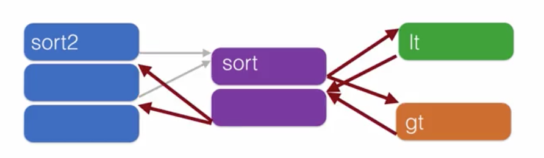

对lt和gt的间接调用以及所有的返回都需要监控，因为它们是通过动态数据进行的。返回值将从堆栈中弹出，这是可动态更改的。跳跃，lt和gt的调用，是通过函数指针的再次推入堆栈。

我们要实现一个内嵌监视器作为程序转换。它的工作方式是，我们可以在间接传输的目标地址之前插入一个标签。在每次间接传输时插入代码来检查目标的标签。如果标签不是我们想要的，我们就会中止。

我们怎么知道我们期望什么?从控制流程图的分析。

最简单的方法就是随机取一个值，标记为l，然后把它放在整个程序中所有间接转移的可能目标上。这就是所有可以间接跳转到的函数的开始。每次我们返回或通过函数指针调用时，我们要检查，目标是合法的标签L吗?

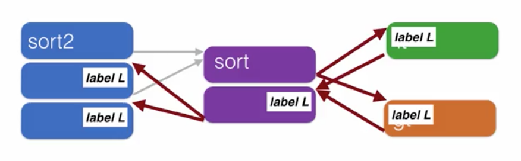

系统命令之前不会有一个标签l，因此，跳转到它的指令再进行攻击就会被拒绝。

但是，还有一种没有经过sort函数就调用lt和gt函数的行为，我们可以通过对间接转移的所有目标进行更详细的标记来克服这种精度限制。

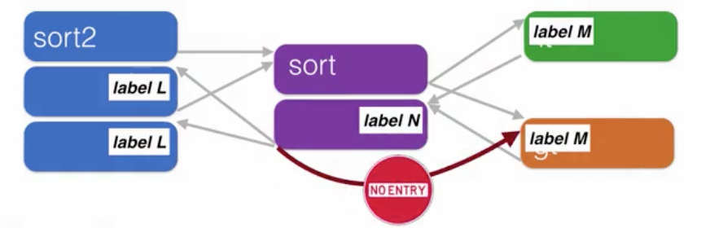

但是这时候如果函数sort2调用sort，然后再返回到label L还是被允许，可这是不合法的情况，也不知道攻击者会怎么利用这个非法的控制流。

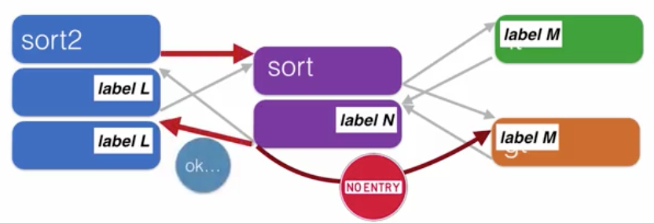

攻击CFI的想法：

- 注入有和法标签的代码
  - 不可行，因为数据是不可执行的，代码是不可变的
- 尝试在检查期间修改堆栈或寄存器
  - 不可行，因为代码是不可变的，也不能改变寄存器中的内容

所以基本上，CFI将战胜控制流修改攻击，比如远程代码注入、ROP/return-to-libc等等。

但CFI它不会阻止图表中的标签所允许的控制流的操作。这些被称为模仿攻击。最近的研究结果表明，简单的单标签控制流图容易受到危险的远程代码注入的影响。

CFI也不能防止数据泄露。例如，漏洞它会溢出一个缓冲区来读取相邻内存中的内容。这不会被阻止，因为这不会影响程序的控制流，只会影响读取的内容。

它也不会影响基于数据而不是基于跳转目标或返回地址目标来确定的控制流。比如if句根据某个变量进行跳转的情况。

## 8、安全的编程

开发人员首先应该努力避免将漏洞引入到他们的程序中。

- 采用规范化的编程模式，避免引入漏洞
- 用高级代码审查和测试机制，在部署之前找到漏洞。
  - 静态程序分析、fuzz测试和符号执行等技术。

通常，安全意识的实践应用于开发过程的设计和实现阶段。建议有两种方式：

- 原则
  - 原则是一个具有多种可能表现形式的设计目标。
- 规则
  - 规则是一种遵循合理设计原则的特殊实践。

这两者之间的区别并不难。例如，一个原则可能是验证你的输入。如何做是不同的，取决于输入的类型。

通用原则：健壮性的编程（robust coding）

- 减少依赖
- 经常地检查某件事是否符合你的预期
- 尽量减少对另一方的信任（minimizing trust）

具体规则：

- 检查输入
- 使用安全的字符串函数
  - 如将strcpy换成strlcpy等

- 不要忘了NUL终止符
  - string要求有一个NUL终止符在字符串末尾
- 使用安全的库函数

