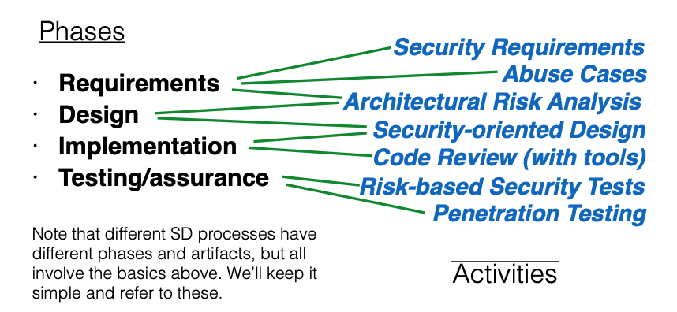

# 设计和开发安全的软件

## 零、课前阅读

之前的内容是构成漏洞的bug，以及避免这些bug、减轻这些bug或从这些bug中恢复的方法。但我们也必须关注缺陷，即软件系统设计中的安全问题。

为了有效地解决缺陷和缺陷，我们需要在整个开发过程中考虑安全性。

学习目标：

- 识别如何将安全思想或安全工程集成到软件开发过程中
- 列举了一系列编写安全软件的设计原则
- 解释这些原则是如何被违反的，并指出实际的事件
- 从设计良好、安全的系统中汲取灵感，将这些原则付诸实践

深入阅读：

- [Top 10 Security Design Flaws](http://cybersecurity.ieee.org/center-for-secure-design/avoiding-the-top-10-security-flaws.html)，IEEE安全设计中心

## 一、介绍

根据是否第一时间考虑软件安全因素可以将软件开发分为两种：

- 有缺陷的方法：设计和开发软件的时候，先忽略安全性问题
  - 当功能性需求满足后，再添加安全性考虑
  - 往往会很难发现全部的潜在的安全性问题
- 更好的方法：从一开始将整个安全性考虑到设计和开发过程中
  - 把安全意识融入到所有的阶段

首先从传统的角度来看软件工程的开发过程，一共包括了如下几个方面：

- Requirements
  - 软件应该做些什么，不应该做什么
- Design
  - 如何构建系统满足软件需求
- Implementation
  - 如何写代码实现软件的设计
- Testing/assurance
  - 检查软件的实现是否符合设计

其中安全工程应该存在于上述所有的阶段。

